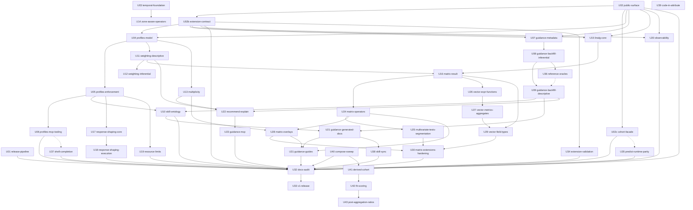

# v1.0.0 Units of Work

The v1.0.0 roadmap broken into **45 Flow-sized units**. Each unit is one initiative: one branch (`branch:` = `slug`), one PR, and 1–3 vertical-slice epics. Every unit document carries:
- machine-readable frontmatter: `id`, `slug`, `depends_on`, `blocks`, `todo_items`, `size`, `status`;
- the outcome and scope;
- the exact TODO items it delivers, quoted verbatim with their `TODO.md` number;
- links to the theme sections to read first;
- epics and stories, acceptance criteria, gates, Update Demand companions, and the human inputs needed.

Every one of the 212 TODO items belongs to at least one unit. The generator asserts this, and each item in [`TODO.md`](../TODO.md) links back to its unit.

These files were generated once from the theme documents and `TODO.md`, and are now maintained by hand. Edit them directly, and keep a unit's `todo_items` in step with the `· [Uxx]` links in `TODO.md`.

## Conventions (match the existing Flow history)

- **Branch / scope:** the unit `slug`.
- **Story commits:** `feat(<slug>/E<n>-S<m>): <what>`, or `fix` / `perf` / `test` / `docs` as appropriate.
- **Epic close:** `milestone(<slug>/E<n>): vertical slice complete — <epic title>`.
- **Release intent:** *none — rolls into v1.0.0*, unless the unit is a deliberate pre-release checkpoint. See [Branching & release strategy](../README.md#branching--release-strategy).
- **Status:** update the unit's frontmatter `status` (`not-started` → `in-progress` → `done`) and tick its TODO items in the same PR.

## Definition of Done (every unit)

- [ ] `make lint` and `make test` pass.
- [ ] Update Demand satisfied: every skill, CLAUDE.md and `.claude/reference/` companion listed in the unit is updated **in the same PR**, and any `.claude/reference/` file the unit names as "load before" was loaded before starting.
- [ ] Every new gate is listed by name in CLAUDE.md "Non-Skippable CI Gates" where its prefix requires it.
- [ ] Every new error code has `codeMetadata` (Message + ≥1 Fixup).
- [ ] Every new operator has an atomic skill, manifest capability entry, example tag, `Since`, dependency edges and (once U07 has landed) `Purpose` / `Interpretation`. It is weight-aware or explicitly refuses a weight (once U11 has landed), and multiplicity-aware if it emits p-values (once U13 has landed).
- [ ] Wire changes are additive. `format_version` stays `"1.1"`. Goldens are regenerated with `-update`, never hand-edited.
- [ ] CLAUDE.md stays ≤ 40,000 bytes (long form goes to `.claude/reference/`).
- [ ] The unit's TODO items are ticked, and its `status` is `done`.

## Suggested order

The IDs are in a valid dependency order, except the units appended later: U35 lands before U32, and U36 (from U08's findings) lands after U08. U37 (shell completion) has no hard dependency and can land any time before U32. U38 (skill sync, appended after U21) lands after U21 and before U32. U39 (code-in attribute, appended after U38) is done and has no dependencies. U40 (compose sweep) was added after U39 and lands before U32; U41, U42 and U43 follow it in a chain (derived cohort, fit scoring, post-aggregation ratios) and are post-U40 units whose v1.0.0 membership is an owner call. U09 is done and no longer waits on U36 (soft dependency). Units on different tracks with no dependency between them can run in parallel sessions.

| # | Unit | Track | Size | Depends on | TODO items |
|---|---|---|---|---|---|
| U01 | [release-pipeline](U01-release-pipeline.md): Every build knows its real version, and a pushed tag ships binaries | API & release | S | — | 5, 6, 7, 8, 9 |
| U02 | [public-surface](U02-public-surface.md): The public Go API is deliberate, and CI guards it | API & release | L | — | 1, 2, 3, 4, 180, 181, 182, 183, 184 |
| U02b | [extension-contract](U02b-extension-contract.md): Embedders author custom operators against a public contract, and the engine is fully internal | API & release | L | U02 | 185, 186, 187, 188, 189 |
| U02c | [cohort-facade](U02c-cohort-facade.md): Embedders read and write cohorts record by record, and predict says whether a crosstab fuses | API & release | M | U02 | 190, 191, 192 |
| U03 | [temporal-foundation](U03-temporal-foundation.md): All date math lives in one place, and requests can name a time zone | Time zones | M | — | 66, 67, 68 |
| U04 | [profiles-model](U04-profiles-model.md): Every feature has a name, and a profile file can declare an instance's feature set | Feature profiles | M | U02, U02b | 10, 11, 12, 13, 14, 15, 16 |
| U05 | [profiles-enforcement](U05-profiles-enforcement.md): Hidden features cannot run and cannot be seen by the engine or self-description | Feature profiles | M | U04 | 17, 18, 19, 20, 21, 22, 23 |
| U06 | [profiles-mcp-tooling](U06-profiles-mcp-tooling.md): MCP servers expose only the profile, and embedders have tools to write and check profiles | Feature profiles | M | U05 | 29, 30, 31, 32, 33, 35 |
| U07 | [guidance-metadata](U07-guidance-metadata.md): Pulse can describe what each operator is for, in plain language, without bloating payloads | Guided analysis | L | U02, U02b | 36, 37, 38, 39, 40, 41, 42 |
| U08 | [guidance-backfill-inferential](U08-guidance-backfill-inferential.md): Every test, overlay and regression explains what it is for and how to read it | Guided analysis | L | U07 | 43, 44, 45 |
| U09 | [guidance-backfill-descriptive](U09-guidance-backfill-descriptive.md): Every operator carries guidance, and the guidance gates are binding | Guided analysis | L | U08 (U36 soft) | 46, 47, 48, 49 |
| U10 | [skill-ontology](U10-skill-ontology.md): Agents only ever see skills and examples for features the instance has | Feature profiles | L | U05, U09 | 24, 25, 26, 27, 28 |
| U11 | [weighting-descriptive](U11-weighting-descriptive.md): Weighted counts, percentages and crosstabs are correct by default when a weight is set | Statistical integrity | L | U04 | 50, 51, 52, 53, 54, 57, 58 |
| U12 | [weighting-inferential](U12-weighting-inferential.md): Significance tests and models are correct on weighted survey data | Statistical integrity | L | U11 | 55, 56, 59 |
| U13 | [multiplicity](U13-multiplicity.md): Analysts can correct for multiple comparisons in one consistent way | Statistical integrity | M | U04 | 60, 61, 62, 63, 64, 65 |
| U14 | [zone-aware-operators](U14-zone-aware-operators.md): Days, weeks and date ranges can mean local calendar days, while storage stays UTC | Time zones | M | U03 | 69, 70, 71, 72 |
| U15 | [linalg-core](U15-linalg-core.md): One trusted linear-algebra core and a mergeable co-moment accumulator, with no user-visible change | Vector & matrix | M | U02, U02b | 73, 74, 75, 76, 77 |
| U16 | [matrix-result](U16-matrix-result.md): A first correlation matrix, end to end, through the library, CLI and MCP | Vector & matrix | L | U15, U11 | 78, 79, 80, 81, 82, 83, 84, 172 |
| U17 | [response-shaping-core](U17-response-shaping-core.md): Callers can say which parts of a response they want | Response shaping | M | U05 | 82, 104, 106, 107, 109, 193 |
| U18 | [response-shaping-execution](U18-response-shaping-execution.md): Unrequested work is never computed, and MCP returns lean responses by default | Response shaping | M | U17 | 105, 108, 110, 111, 217, 218, 219 |
| U19 | [resource-limits](U19-resource-limits.md): Embedders can bound runaway requests, with defaults that never get in the way | Embedder operations | M | U05 | 82, 112, 113, 114, 115, 116, 117 |
| U20 | [observability](U20-observability.md): Hosts can see what Pulse is doing, whether or not they are a server | Embedder operations | M | U02, U02b | 118, 119, 120, 121, 122, 123, 222, 223, 227 |
| U21 | [guidance-generated-docs](U21-guidance-generated-docs.md): Plain-language reference docs and skill sections generate themselves from metadata | Guided analysis | M | U09, U10 | 85, 86, 87, 88, 89, 34 |
| U22 | [recommend-explain](U22-recommend-explain.md): Developers and agents can go from a question to a valid request, and from a result to plain language | Guided analysis | L | U09, U11, U13 | 90, 91, 92, 93, 94 |
| U23 | [guidance-mcp](U23-guidance-mcp.md): MCP agents are guided from intent to result in few round-trips | Guided analysis | M | U22 | 95, 96, 97, 98, 99, 246, 247 |
| U24 | [matrix-operators](U24-matrix-operators.md): Analysts get the core multivariate toolkit: rank correlations, partial correlations, reliability, PCA, collinearity | Vector & matrix | L | U16 | 124, 125, 126, 127, 128, 129, 130, 172, 258 |
| U25 | [multivariate-tests-segmentation](U25-multivariate-tests-segmentation.md): Analysts can test whole profiles, flag unusual rows, score components and segment records | Vector & matrix | L | U24 | 131, 132, 133, 134, 135, 136, 262, 263, 264 |
| U26 | [vector-expr-functions](U26-vector-expr-functions.md): Formulas and filters can work with whole vectors and sets | Vector & matrix | M | U16 | 137, 138, 139, 140 |
| U27 | [vector-metrics-aggregates](U27-vector-metrics-aggregates.md): Similarity is safe by default, and groups can be summarized as profiles | Vector & matrix | M | U26 | 141, 142, 143, 144 |
| U28 | [matrix-overlays](U28-matrix-overlays.md): Crosstabs and matrices gain residuals, perceptual maps, flow projections, raking and corrected p-values | Vector & matrix | L | U24, U13 | 145, 146, 147, 148, 149, 150, 261, 265 |
| U29 | [vector-field-types](U29-vector-field-types.md): Cohorts can store fixed-length numeric vectors natively | Vector & matrix | L | U16, U27 | 151, 152, 153, 154, 155 |
| U30 | [matrix-extensions-hardening](U30-matrix-extensions-hardening.md): Embedders can add their own matrix operators, and the matrix stack is proven at scale | Vector & matrix | M | U25, U28, U29 | 156, 157, 158, 270 |
| U31 | [guidance-guides](U31-guidance-guides.md): A developer can start from a question and find the right analysis without knowing statistics | Guided analysis | M | U21, U24, U28 | 100, 101, 102, 103, 250, 251, 252, 269 |
| U32 | [docs-audit](U32-docs-audit.md): Pulse goes live with the most helpful, current and comprehensive documentation we can produce | API & release | L | U01, U02, U02b, U02c, U34, U35, U06, U10, U18, U19, U20, U23, U30, U31, U37, U38, U40 | 159, 160, 161, 162, 163, 164, 165, 166, 167, 238, 239, 257, 268 |
| U33 | [v1-release](U33-v1-release.md): Pulse v1.0.0 is released with a written stability promise | API & release | S | U32 | 168, 169, 170, 171, 173, 174, 175, 176, 177, 178, 179, 206, 220, 232, 233, 234 |
| U34 | [extension-validation](U34-extension-validation.md): Extension registrations are validated as strictly as built-ins, and chain predict knows them | API & release | S | U02b | 194, 195, 196, 197, 216, 231 |
| U35 | [predict-runtime-parity](U35-predict-runtime-parity.md): Predict and runtime agree on every built-in, and the runtime never answers with a wrong number | API & release | M | U02c (soft) | 198, 199, 200, 201, 207, 213, 214, 215, 221, 248, 249, 253, 254, 255, 256, 259, 260, 267 |
| U36 | [reference-oracles](U36-reference-oracles.md): Every inferential output is pinned to an external reference, and none answers with a wrong or unencodable number | Statistical integrity | M | U08 | 202, 203, 204, 205, 266, 271 |
| U37 | [shell-completion](U37-shell-completion.md): The pulse CLI completes commands, flags and values natively in the terminal | API & release | M | — (U06 soft) | 208, 209, 210, 211, 212 |
| U38 | [skill-sync](U38-skill-sync.md): Hand-written skills say exactly what the engine does, and every skill fits its budget | Guided analysis | M | U21 | 235, 236, 237 |
| U39 | [code-in-attribute](U39-attr-code-in.md): A top-box share of the whole base is one attribute and one weighted mean on the fused crosstab path | Guided analysis | S | — | 240, 241, 242, 243, 244, 245 |
| U40 | [compose-sweep](U40-compose-sweep.md): A parameter grid is one compose request: Pulse expands it, runs every combination and ranks the results | API & release | M | — | 272, 273, 274, 275, 276, 277, 278, 297, 298 |
| U41 | [derived-cohort](U41-derived-cohort.md): A request's derived columns become a new cohort with the schema carried over, and the import that follows cannot mislabel a column | API & release | L | U40 | 279, 280, 281, 282, 283, 284, 285 |
| U42 | [fit-scoring](U42-fit-scoring.md): A fitted model is applied to rows by name, its error is an aggregator, and its interval bounds pass through | API & release | L | U41 | 286, 287, 288, 289 |
| U43 | [post-aggregation-ratios](U43-post-aggregation-ratios.md): A ratio of two aggregates and a scalar derived from an aggregate are native, so ROI and a scenario scale factor need no hand arithmetic | API & release | M | U42 | 290, 291, 292 |

## Dependency graph

## Human inputs that gate units

- **U02 public-surface:** none blocking — the downstream catalog is delivered (#1) and the classification decided (#2); whether U02 or U02b moves `processing` is the implementer's call
- **U08 guidance-backfill-inferential:** done without a human reviewer — an automated review (deterministic gates + an advisory LLM panel) is recorded in [`reviews/U08-statistics-review.md`](../reviews/U08-statistics-review.md); human sign-off moved to U33
- **U09 guidance-backfill-descriptive:** done without a human reviewer — an automated review is the U09 section of [`reviews/U08-statistics-review.md`](../reviews/U08-statistics-review.md); human sign-off moved to U33 (#206)
- **U12 weighting-inferential:** done without a human reviewer — an automated review of the `n_eff` semantics and every lifted weighted formula is recorded in [`reviews/U12-weighting-review.md`](../reviews/U12-weighting-review.md); the human glance moved to U33 (#206)
- **U24 matrix-operators:** Statistics reviewer for Purpose/Interpretation of the new operators
- **U25 multivariate-tests-segmentation:** Statistics reviewer
- **U28 matrix-overlays:** Decide the correspondence-analysis payload shape (open question in vm6)
- **U32 docs-audit:** Maintainer sign-off; a fresh reader (developer without a statistics background) for the review
- **U34 extension-validation:** the synth-distribution decision (#197): extension category or retire the slot; whether a feature profile can hide `LookupTables`
- **U35 predict-runtime-parity:** multi-entry `Groups` — execute every group or refuse (#200)
- **U36 reference-oracles:** Shapiro–Francia at n < 5 (refuse or exact method); how an infinite statistic is encoded
- **U37 shell-completion:** whether completion respects a feature profile; library helper vs internal CLI glue; where field-taking flags find their cohort
- **U33 v1-release:** Maintainer runs the downstream validation and tags the release; **a named statistics reviewer signs off the U08 review record (#206, release-blocking)** and lands the statistical-review CODEOWNERS entries

Sizes: **S** ≈ one focused session; **M** ≈ 2–3 sessions; **L** ≈ 3–5 sessions. These are relative and meant for Flow's planning, not commitments.
