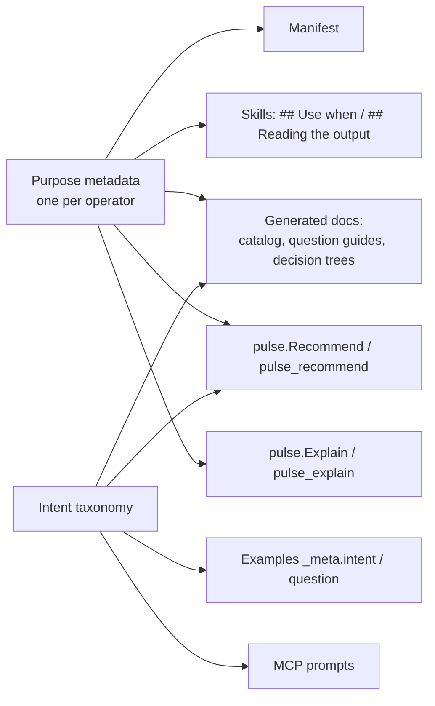

# Guided Analysis — v1.0.0 Overview

**Status:** proposal · **Target:** v1.0.0 · **Companion to:** [vector & matrix theme](../v1.0.0-vector-matrix/00-overview.md)

## The problem

Pulse is precise about **how** each operator works and almost silent about **why you would reach for it**. Today a developer who wants to know "are customers in different regions equally satisfied?" has to already know:

1. that this is a *comparison of group means*;
2. that the answer is `TEST_ANOVA_F`, or `TEST_KRUSKAL_WALLIS` if the data is skewed, or `TEST_T` / `TEST_WELCH` if there are only two regions;
3. how to read an F statistic, a p-value and an effect size once it runs.

The existing surfaces don't close that gap:

| Surface | What it says today | What is missing |
|---|---|---|
| Manifest `description` | "Standardized z-score aggregate (mean-centered, stddev-scaled summary)." | what question it answers, when not to use it |
| Atomic skill (`op-*.md`) | `Params` / `Inputs` / `Output` / `Gotchas` — a contract written for agents, about 300 tokens | the plain-language purpose and how to read the result |
| `pulse_examples_search` | substring and tag match over names and operators | search by *question*; why this example is the right one |
| `pulse_predict` | whether a request is valid, and its cost | whether it is the *right* request for the stated goal |
| mdBook | CLI, library and format reference; one operator-family page (regression) | question-first guides, interpretation, glossary |

The vector & matrix theme makes this worse. It roughly doubles the statistical vocabulary (PCA, Mahalanobis, MANOVA, correspondence analysis…), and most of that is opaque to anyone who is not a statistician.

## The goal

> A developer or an agent can start from a **question in plain words** and get to a **correct, runnable Pulse request** and a **plain-language reading of its result**, without needing to know the statistics vocabulary first.

## Who this serves

| Persona | Need |
|---|---|
| **Integrating developer** (the primary target: knows Go, not statistics) | browse "what can Pulse answer", pick an operator with confidence, explain the output to their own users |
| **Analyst** (knows the statistics, not Pulse) | find Pulse's name for the method they already know ("where is SPSS RELIABILITY?") |
| **LLM agent via MCP** | turn a user's question into a valid request in few round-trips and tokens, and narrate the result correctly |

## The approach in one picture

There is **one new source of truth**: *purpose metadata*, a structured, plain-language description of what each operator is for. It is declared beside the existing capability declarations and enforced by a coverage gate. It sits on a small, fixed **intent taxonomy** of question types. Everything else is a projection of those two, so documentation, skills, MCP tools and the library API cannot drift apart. This is the same model Pulse already uses for the manifest.

## Documents in this set

| # | Document | Covers |
|---|---|---|
| 00 | this file | problem, goal, personas, approach, feature map |
| 01 | [Purpose metadata & intent taxonomy](01-purpose-metadata.md) | the data model, the intents, interpretation rules, the gates |
| 02 | [Documentation](02-documentation.md) | question-first guides, generated catalog, decision trees, glossary, "reading your results", story examples |
| 03 | [MCP & API: from need to request](03-mcp-and-api.md) | `Recommend`, `Explain`, predict advisories, MCP prompts, search and token optimizations |
| 04 | [Phasing & open questions](04-phasing.md) | epics, gates, Update Demand impact, risks |

## Feature map

Tier key: **C** = committed for v1.0.0 · **S** = stretch · **P** = post-1.0.

| Area | Feature | Tier |
|---|---|---|
| Foundation | Intent taxonomy (about 12 question types) | C |
| Foundation | `Purpose` block on every operator: plain summary, questions answered, use cases, not-for, assumptions, alternatives | C |
| Foundation | `Interpretation` rules: how to read each output field, with rule-of-thumb bands | C |
| Foundation | Glossary registry: terms with a one-line definition and a "why you care" line | C |
| Gates | `TestSkillsCoverAllPurposes`, `TestPurposeQuestionsResolve`, `TestGlossaryTermsResolve` | C |
| Skills | New required sections `## Use when` and `## Reading the output` (generated from metadata, then checked) | C |
| Docs | "What can Pulse answer?" landing page, organised by question | C |
| Docs | Question guides (one per intent) with decision trees | C |
| Docs | Generated operator catalog in plain language | C |
| Docs | Glossary page | C |
| Docs | "Reading your results" pages per result family | C |
| Docs | Story examples (question → request → output → interpretation) | C |
| Docs | "Coming from SPSS / R / pandas / SQL" translation tables | S |
| API + MCP | `pulse.Recommend` / `pulse_recommend` / `pulse recommend`: intent plus cohort in, ranked runnable drafts out | C |
| API + MCP | `pulse.Explain` / `pulse_explain` / `pulse explain`: a request or response in, plain-language narration out | C |
| API + MCP | Predict `advisories`: plain-language assumption and fit checks | C |
| MCP | MCP **prompts**, one guided workflow per intent | C |
| MCP | `pulse_examples_search` by intent and question, plus a synonym table | C |
| MCP | Intent-scoped manifest view (`pulse_manifest {intent}`) for fewer tokens | S |
| API | Opt-in `Response.Interpretation` slot | S |
| Docs | Interactive decision-tree page in the docs site | P |

## Principles

1. **No LLM inside Pulse.** Recommend and Explain are deterministic: they use lookup tables, schema-type matching and templated text. Understanding natural language is the *calling* agent's job. Pulse supplies the structured catalog the agent matches against. This keeps Pulse harness-agnostic and its output golden-testable.
2. **Generated, not hand-maintained.** Catalog pages, decision trees and skill sections are rendered from metadata, and a gate fails when the rendered output is stale.
3. **Plain words first, precision second.** Every entry leads with a sentence a non-statistician can act on. The contract detail stays where it is, one click away.
4. **Say what *not* to use.** The most valuable guidance is usually "use X instead when…". Every operator must carry at least one not-for entry.
5. **Honest interpretation.** Rule-of-thumb bands ("r of 0.3 is a moderate relationship") are labelled as conventions, cite their source convention (e.g. Cohen 1988), and never replace the number.
