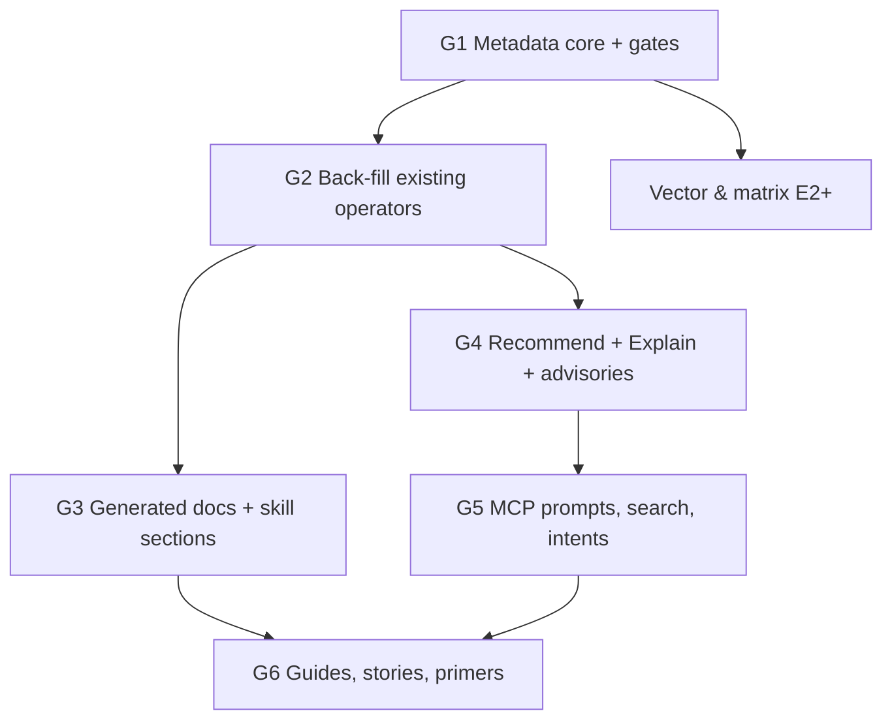

# 04 — Phasing, Update Demand impact, risks, open questions

## Ordering relative to the vector & matrix theme

The **purpose metadata must land first.** If it lands after the vector & matrix operators, about 30 new operators ship without guidance and need back-filling, and per CLAUDE.md that follow-up never happens. The proposal is to treat G1 as a prerequisite of vector-matrix E2: once G1 exists, `TestSkillsCoverAllPurposes` forces every new `MAT_*` operator to carry its purpose from day one.

## Epics

### G1 — Metadata core (C)
- S1: intent taxonomy, `Purpose`, `Interpretation` and glossary types in `descriptor/`; manifest projection; payload-schema and manifest goldens.
- S2: the gates (`TestSkillsCoverAllPurposes` and friends). These start in **report-only** mode, listing the missing operators, following the precedent of `TestSkillTokenBudget`'s soft regime.
- S3: the extension `Purpose` hook.

### G2 — Back-fill (C)
- Write `Purpose` + `Interpretation` for every existing operator: about 165 across aggregators, attributes, filterers, groupers, windows, features, tests, regressions, overlays and synth. Order by audience value: tests → overlays → regressions → aggregators → the rest.
- Flip the gates from report-only to failing when complete.
- **Effort note.** This is the largest single cost in the theme. It parallelises well per category, and the `pulse-docs-skills` agent is well suited to drafting it, with statistical review by a human.

### G3 — Generated docs & skill sections (C)
- `internal/docgen`, `make docs` integration, `TestDocsGeneratedCurrent`.
- Operator catalog pages, glossary page, "Reading your results" pages.
- Skill `## Use when` / `## Reading the output` rendering; the `skill-pack.md` section-table and budget update.

### G4 — Recommend, Explain, advisories (C)
- `pulse.Recommend` + CLI leaf + `pulse_recommend` + skill.
- `pulse.Explain` (request mode, then response mode) + CLI leaf + `pulse_explain` + skill.
- Predict advisories + codes + fixups.
- Golden tests: one Explain golden per operator family, plus a Recommend golden per intent against the examples fixtures.

### G5 — MCP guidance layer (C)
- MCP prompts per intent and their gate.
- `intents[]` in the manifest, the synonym table, examples / skills search by intent.
- Tool descriptions rewritten so the first sentence says when to call the tool.
- Stretch: intent-scoped manifest, "did you mean" errors, `Response.Interpretation`.

### G6 — Hand-written guides (C)
- The landing page and 12 question guides (prose around generated blocks).
- Story examples: `_meta` extension, at least one per intent.
- Vector & matrix concept primers (co-scheduled with that theme).
- Stretch: SPSS / R / pandas / SQL translation tables.

## Update Demand impact

| Change | Companions |
|---|---|
| New facade methods `Recommend`, `Explain` (+ `Describe` if stretch lands) | CLAUDE.md design-principles facade list |
| New MCP tools `pulse_recommend`, `pulse_explain` | `skills/tool-recommend.md`, `skills/tool-explain.md`, `mcp/toolmeta/meta.go` |
| New CLI leaves `recommend`, `explain` | `docs/src/cli/flags.md` index, `skills/session-bootstrap.md` |
| MCP prompts (new primitive) | CLAUDE.md MCP layer paragraph; a new gate; `mcp/gosdk` registration |
| Manifest `intents`, `purpose`, `interpretation`, glossary | manifest golden; `update-demand.md` new row ("A registered operator → also its `Purpose`") |
| New required skill sections | `.claude/reference/skill-pack.md` required-section table + budget |
| Advisory codes | `errors/codes.go`, `errors/fixup_metadata.go`; consider a new `ADVISORY` category in the code scheme or keep the `PULSE_` domain |
| `PredictResult.Advisories`, optional `Response.Interpretation` | payload schema + golden; CLAUDE.md "Output Format Contract" (additive, `format_version` stays `"1.1"`) |
| CLAUDE.md size budget | the long form goes to a new `.claude/reference/guided-analysis.md`; CLAUDE.md gets about 5 lines plus a pointer |

The Update Demand table itself gains a row: **"A registered operator (any category) → its `Purpose` (+ `Interpretation` if inferential)."** That turns guidance into a contract rather than a courtesy.

## Risks

| Risk | Mitigation |
|---|---|
| Wrong statistical advice is worse than none | every Purpose / Interpretation needs a statistics-literate reviewer (CODEOWNERS on `descriptor/purpose_*.go`); bands always name their convention; Explain never says "no difference" |
| Back-fill fatigue: about 165 entries of boilerplate | gates in report-only mode first; parallel per category; reuse the existing skill `## Gotchas` content as raw material |
| Recommend looks like magic and users over-trust it | every recommendation carries `why`, alternatives and advisories; docs frame it as "a starting point you confirm" |
| Explain text drifts from reality as operators evolve | rendered from the same metadata as docs, golden-tested per operator |
| Prompt and token bloat for MCP | rendered skill sections capped; intent-scoped manifest; the glossary is a separate resource, not inlined |
| Scope collides with templating | none: templates are stored *requests*, Recommend produces *draft* requests; a template can be the output of an accepted recommendation (a nice follow-up) |

## Open questions

1. **Domains.** Are the four audience domains (survey, ops, science, harness) the right fixed keys for `UseCases`, or should `UseCases` be free-form tags?
2. **Advisory code namespace.** Should advisories use a `PULSE_ADVISORY_*` prefix in the existing `PULSE` domain, or a seventh error domain `ADVISORY`? The latter touches the six-domain rule in CLAUDE.md.
3. **Recommend without a cohort.** Should `Recommend` work from an intent alone (returning operator choices without bound fields), or always require a schema? The proposal is to allow both, since the no-cohort mode is useful for docs and early exploration.
4. **Who reviews statistical content?** Is there a reviewer available for the G2 back-fill, or should the first pass be limited to the bands and conventions that are textbook-standard?
5. **Response.Interpretation in v1.0.0?** It saves an MCP round-trip but adds a Response slot. Commit, or keep it as stretch?
