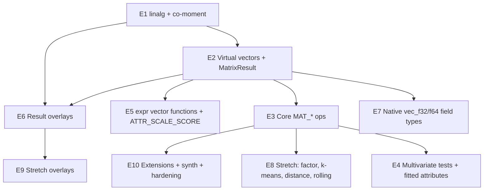

# 06 — Phasing, dependencies, risks, open questions

Epics follow the repo's existing milestone convention (`milestone(<theme>/E<n>)`, stories `E<n>-S<m>`). Each epic is designed as a **vertical slice**: it ships code, tests, skills, manifest declarations and docs together, per the Update Demand.

## Dependency graph

E6 (result overlays on crosstabs) depends only on `linalg` and the MATRIX_RESULT host, so it can proceed **in parallel** with E3–E5. Correspondence analysis, residuals, Markov and raking don't need vectors at all, and they are some of the highest-value items for survey and ops users.

## Epics

### E1 — Linear-algebra core & co-moment accumulator (C)
- S1: create `linalg/` with Cholesky, SymEigen, SVD, QR, tolerances, the sign convention, and an import-boundary gate.
- S2: migrate synth's Cholesky with byte-identical fidelity goldens; migrate regression's solve.
- S3: `comoment.Accumulator` (weighted, listwise and pairwise) with exact merge, plus property tests that merge(a, b) equals a single pass.
- S4: deterministic merge-tree test under `ShardWorkers` / `DecodeWorkers`.
- **Exit:** no user-visible change; all goldens unchanged.

### E2 — Virtual vectors & the matrix result slot (C)
- S1: `Request.Vectors` covering resolution, hashing, projection and predict echo.
- S2: `Request.Matrices` / `Response.Matrices`, `MatrixResult`, `MatrixPayload` symmetric/upper encoding.
- S3: components floor, manifest `Matrix` block, payload-schema golden, `.claude/reference/matrix-and-vectors.md`.
- S4: `MAT_COVARIANCE` and `MAT_CORRELATION` (Pearson) as the first operators, with parity tests against `TEST_PEARSON_R`.
- **Exit:** first end-to-end correlation matrix via CLI, MCP and the library.

### E3 — Core matrix operators (C)
- `MAT_CORRELATION` Spearman/Kendall (buffered), `MAT_PARTIAL_CORRELATION`, `MAT_RELIABILITY`, `MAT_PCA`, `MAT_COLLINEARITY`.
- `RegressionResult.Vcov` / `.Correlation`.
- Topical skill `multivariate-design.md`.

### E4 — Multivariate tests & fitted row attributes (C)
- `TEST_HOTELLING_T2`, `TEST_MANOVA`, `TEST_BARTLETT_SPHERICITY`.
- `ATTR_MAHALANOBIS`, `ATTR_PC_SCORE` (two-pass fit/score, `fit_on`).

### E5 — Row-wise vector vocabulary (C)
- expr-lang vector bindings and functions, plus the missing scalar maths functions.
- `ATTR_SCALE_SCORE`; `AGG_VEC_MEAN`, `AGG_VEC_SUM` (array value + `expand`).

### E6 — Matrix operations on crosstab results (C)
- MATRIX_RESULT host and the `Ref.Matrix` reference family.
- `OVERLAY_STD_RESIDUAL`, `OVERLAY_CORRESPONDENCE`, `OVERLAY_MARKOV`, `OVERLAY_RAKE`, `OVERLAY_CORR_PVALUE`.

### E7 — Native vector field types (C)
- `vec_f32` / `vec_f64`: the encoding and the `VECTORS` extension section (tag 2), the `ReadVector` accessor, and a v1-read compatibility test.
- Import `--vector` folding (CSV / NDJSON / Arrow / Parquet); export expansion; shard cohesion; group membership.
- `type-vec-*` skills; the byte-layout reference; the CLAUDE.md invariants update.
- *Placed late deliberately:* it is the only format change in the theme, and virtual vectors give every operator a test bed beforehand.

### E8 — Stretch operators (S)
- `MAT_FACTOR` + `ATTR_FACTOR_SCORE`.
- `GROUP_KMEANS`.
- `MAT_DISTANCE`, `ATTR_PROFILE_SIMILARITY`, `ATTR_VEC_DISTANCE`.
- `WIN_ROLLING_CORR`, `WIN_ROLLING_BETA`.
- `TEST_BOX_M`, `TEST_MARDIA`; `AGG_VEC_SD`; `vec_u8`.

### E9 — Stretch overlays (S)
- `OVERLAY_PROFILE_SIMILARITY`, `OVERLAY_SERIATION`, `OVERLAY_MATRIX_FORMULA`, `OVERLAY_MATRIX_CONGRUENCE`.

### E10 — Extensions, synth, hardening (C for extensions; S for synth)
- `MatrixOpRegistration`, the `MAT` naming policy, probe validation.
- Synth declared correlation matrix and fidelity matrix distance.
- Benchmarks: p = 50 / 256 at 1M and 10M rows; peak heap; shard scaling.
- Examples library entries for every operator (required by `TestEveryOperatorHasAnExampleTag`).

## Suggested release cut

| Release | Contents |
|---|---|
| v1.0.0 (committed) | E1–E7, E10 extensions |
| v1.0.0 (if capacity) | E8 and E9 in priority order: `MAT_FACTOR` → `GROUP_KMEANS` → `OVERLAY_SERIATION` → `OVERLAY_PROFILE_SIMILARITY` → the rest |
| v1.1 | remaining stretch, streaming running-matrix chunks, synth items |
| post-1.0 | canonical correlation, multi-Y OLS, PCR/PLS, MCA, rake-to-weights output, network centrality |

## Risks

| Risk | Mitigation |
|---|---|
| Silent numerical drift between serial and parallel arms | deterministic merge tree (E1-S4) before any operator ships |
| Quadratic payloads overwhelm MCP clients | `MaxMatrixDim`, upper-triangle encoding, `precision`, `top_pairs` |
| CLAUDE.md budget pressure | `.claude/reference/matrix-and-vectors.md` created in E2-S3, before the prose accumulates |
| Pairwise deletion produces invalid matrices that feed decompositions | refuse downstream unless repair is opted in (X2) |
| Analyst misuse: uncorrected p-values over 190 pairs | `OVERLAY_CORR_PVALUE` committed; multivariate-design skill warns loudly |
| Format change (vec types) breaks older readers | REQUIRED extension section, so older binaries refuse loudly; release note |
| Scope creep toward ML | the exclusion list in 00; any new "ML-sounding" item must name its classical-statistics precedent |

## Open questions (need a decision before the relevant epic)

1. **Vector-valued aggregator output (E5).** Should the value be an array in `Response.Data` or expanded columns by default? The proposal is an array with an `expand` option.
2. **Correspondence-analysis payload (E6).** Should it be a two-axis payload (`Series2`), two layers, or a new `coordinates` shape? A new shape is cleanest but widens the overlay payload union.
3. **Request-level default weight (X1).** Should this be a separate small proposal or folded into E2?
4. **Pairwise-deletion default.** `listwise` is safe; SPSS defaults vary by procedure. Should Pulse ever default to pairwise for `MAT_CORRELATION` alone?
5. **Probability vs frequency weights in inference.** Should probability weights use Kish effective-n in v1.0.0, or should design-based variance (stratification, clustering) be out of scope? The latter is recommended.
6. **`MAT_` as a new category vs riding `TEST_` / `AGG_`.** A new category costs a manifest slice, gates and an extension namespace, but keeps `TestResult` scalar and honest. The proposal is a new category.
7. **Should `GROUP_KMEANS` be promoted to committed?** It is the highest-value stretch item for market research.
8. **Shared multiple-comparison core.** Should `OVERLAY_CORR_PVALUE`'s Holm/BH adjustment also be offered on the existing `OVERLAY_PAIRWISE_*` family in v1.0.0?
