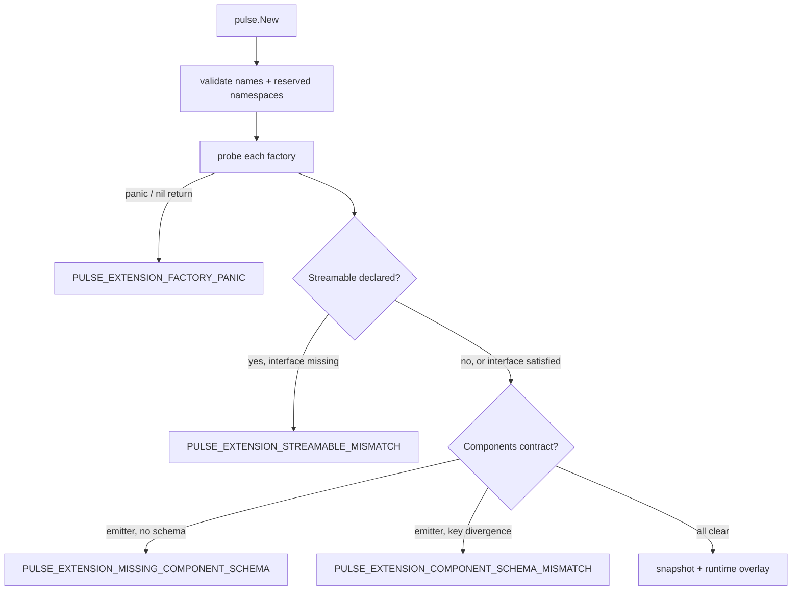

# Extension Points

**Audience:** Pulse embedders writing Go code that calls
`pulse.New(pulse.Options{Extensions: ...})` to inject domain-specific
operators or expression-runtime extensions. If you are adding a new
built-in operator to Pulse itself, see [Adding an
Aggregator](adding-aggregator.md) (and its sibling recipes) instead.

The extension surface is Go-native. There is no plugin loader, no `.so`
files, no hot reload. Registration happens once when the embedding
binary constructs its Pulse instance, and the registration set is fixed
for the lifetime of that instance — restart to change it. Registered
extensions are first-class participants in Predict / Inspect / Process
/ Compose / Manifest: the runtime treats them identically to built-ins,
the manifest advertises them, and the schema-bound MCP tools include
their names in per-category enums.

The implementation lives in the repository root: `extensions.go`
(public types), `extensions_validate.go` (name + registration shape
checks), `extensions_probe.go` (factory probe and components parity),
`extensions_runtime.go` (built-in/extension fold into the runtime
registry), `extensions_snapshot.go` (descriptor-side read-only
projection), and `processing/extensions.go` (the runtime overlay the
processing layer consults).

## When to register vs use a built-in

Use a **built-in** operator when the semantics already ship with Pulse,
or when an `ATTR_FORMULA` plus a custom `ExprFunction` covers the
behaviour. Use a **registered extension** when you need:

- An operator that encodes proprietary business logic that should not
  live in Pulse core (e.g. a domain-specific composite score).
- A closed-form function call from within `ATTR_FORMULA` /
  `FILTER_EXPRESSION` (e.g. `rank_familiarity(value, total_pop)`).
- A static keyed lookup table that drives multipliers or calibration
  factors (e.g. per-`(study, wave)` adjustment).
- Manifest + MCP visibility so LLM agents can discover and invoke your
  operators alongside Pulse built-ins.

## The `Extensions` struct

The full public surface is a single struct on `pulse.Options`:

```go
import "github.com/frankbardon/pulse"

ext := pulse.Extensions{
    Aggregators:        []pulse.AggregatorRegistration{...},
    Attributes:         []pulse.AttributeRegistration{...},
    Filterers:          []pulse.FiltererRegistration{...},
    Groupers:           []pulse.GrouperRegistration{...},
    Windows:            []pulse.WindowRegistration{...},
    Features:           []pulse.FeatureRegistration{...},
    Tests:              []pulse.TestRegistration{...},
    SynthDistributions: []pulse.DistributionRegistration{...},

    ExprFunctions: []pulse.ExprFunction{...},
    LookupTables:  map[string]pulse.LookupTable{...},
}

p, err := pulse.New(pulse.Options{
    FS:         myFs,
    Extensions: ext,
})
```

A zero-value `Extensions` is the no-op case — `pulse.New` behaves
exactly as the unmodified binary. All registrations are validated
together; the first failure short-circuits `pulse.New` with a typed
`CodedError`.

## Naming policy

Embedder registrations MUST use a three-segment namespaced form:

```
<CATEGORY>_<NAMESPACE>_<NAME>
```

The regex enforced by `extensions_validate.go` is:

```
^(AGG|ATTR|FILTER|GROUP|WIN|FEAT|TEST|SYNTH)_[A-Z][A-Z0-9]+_[A-Z](?:[A-Z0-9_]*[A-Z0-9])?$
```

| Example | Category | Namespace | Name |
|---|---|---|---|
| `AGG_ACME_BRAND_SCORE` | aggregator | ACME | BRAND_SCORE |
| `ATTR_ACME_ADJUSTMENT` | attribute | ACME | ADJUSTMENT |
| `FILTER_ACME_GEO_FENCE` | filterer | ACME | GEO_FENCE |
| `TEST_FINANCE_VAR` | test | FINANCE | VAR |

Failure modes raised at registration time:

- Name fails the regex → `PULSE_EXTENSION_NAME_INVALID`.
- Namespace is one of the reserved values `BUILTIN`, `STANDARD`,
  `CORE`, `PULSE` → `PULSE_EXTENSION_NAME_RESERVED`.
- Name collides with a built-in (e.g. registering `AGG_COUNT`) →
  `PULSE_EXTENSION_NAME_COLLISION`.
- The same name appears twice in one `pulse.New` call →
  `PULSE_EXTENSION_DUPLICATE`.

Two embedders in the same process must use disjoint namespaces.

## Per-category registration shapes

The eight operator categories plus expression functions and lookup
tables cover everything `pulse.Options.Extensions` accepts. Field-input
introspection and component-schema emission attach to operator
registrations as additional optional fields — see the dedicated
sections below.

### Aggregator

```go
{
    Name:        "AGG_ACME_BRAND_SCORE",
    Description: "ACME brand composite (0-100).",
    Factory:     acme.NewBrandScoreAggregator,    // processing.AggregatorFactory
    Streamable:  true,                            // factory MUST return OnlineAggregator
    Accepts:     []encoding.FieldType{encoding.FieldTypeF64},
    Params:      []pulse.ParamMeta{{Name: "weights", JSONType: "array"}},
    ComponentSchema: descriptor.ComponentSchema{ /* see below */ },
    ComponentsFunc:  func(instance processing.Aggregator) (map[string]any, error) { /* ... */ },
}
```

When `Streamable=true`, the probe at `pulse.New` time asserts that the
factory's returned value implements `processing.OnlineAggregator`.
Mismatch surfaces as `PULSE_EXTENSION_STREAMABLE_MISMATCH`.

### Attribute

```go
{
    Name:        "ATTR_ACME_ADJUSTMENT",
    Description: "Per-(study, wave) multiplier.",
    Factory:     newAdjustmentAttribute,           // processing.AttributeFactory
    Mode:        pulse.AttributeModeRowLocal,       // row_local | two_pass | buffered
    Accepts:     []encoding.FieldType{encoding.FieldTypeF64},
    Emits:       pulse.AttributeEmitFloat64,
}
```

`Mode` drives streaming-tier validation: `row_local` requires
`processing.RowLocalAttribute`, `two_pass` requires
`processing.TwoPassAttribute`, `buffered` requires only the base
`processing.AttributeComputer`. Attributes do NOT declare a
`ComponentSchema` (see the table in the **Component schemas** section).

### Filterer, Grouper, Window, Feature

All four follow the same envelope: name, description, factory, accepted
types, params metadata. `FiltererRegistration` and `GrouperRegistration`
additionally carry `ComponentSchema` + `ComponentsFunc` on the same
contract as `AggregatorRegistration`. Filterers are always row-local
streamable; windows always run buffered.

### Test (tier-1 / tier-2)

```go
// Tier-1 (folds during streaming aggregation pass):
{
    Name:       "TEST_ACME_PROXY",
    Tier:       pulse.TestTierRow,
    RowFactory: newProxyRowTest,                  // processing.RowTestFactory
    Streamable: true,
}

// Tier-2 (runs over materialised result rows after windows):
{
    Name:        "TEST_ACME_AGGREGATE_CHECK",
    Tier:        pulse.TestTierPost,
    PostFactory: newAggregateCheckPostTest,       // processing.PostTestFactory
}
```

Exactly one of `RowFactory` / `PostFactory` must be non-nil and match
`Tier`. Tier-2 tests always run buffered; `Streamable` on a tier-2
registration is ignored.

### Synth distribution

Reserved for embedders shipping bespoke samplers. The factory shape
finalises alongside the synth distribution overlay phase; until then
the registration validates name + duplicates and reserves the
namespace.

### Expression functions

Custom Go functions become callable from `ATTR_FORMULA` and
`FILTER_EXPRESSION`:

```go
{
    Name:        "rank_familiarity",
    Description: "ACME brand familiarity rank.",
    Signature:   "rank_familiarity(value float64, total_pop bool) float64",
    Fn:          acme.RankFamiliarity,
    Pure:        true,        // declares side-effect-free; reserved for future memoisation
}
```

Pulse passes `Fn` to expr-lang's `expr.Function(name, fn)`. expr-lang
accepts typed functions via reflection — `func(v float64) float64` and
`func(args ...any) (any, error)` both work. Use the variadic shape
when zero-allocation calling matters.

### Lookup tables

Static keyed tables exposed via the built-in `lookup(table, keys...)`
function:

```go
LookupTables: map[string]pulse.LookupTable{
    "adjustments": {
        Description: "Per-(study, wave-date) calibration multipliers.",
        // Rows is the simple path — caller-joined composite key.
        Rows: map[string]float64{
            "study_a|2025-01-01": 1.07,
            "study_a|2025-02-01": 1.12,
        },
        // OR — Lookup is the escape hatch:
        // Lookup: func(keys ...string) (float64, bool, error) { ... }
    },
},
```

Exactly one of `Rows` / `Lookup` must be non-nil; validation at
`pulse.New` returns `PULSE_EXTENSION_PARAM_INVALID` otherwise.
`Rows`-backed tables join keys with `|` before indexing. The `Lookup`
function-backed path receives the key slice directly — compose keys
however you want, perform partial-match fallback, or pull from an
external store.

At evaluation time `lookup()` raises `PULSE_LOOKUP_TABLE_UNKNOWN` for
an unregistered table and `PULSE_LOOKUP_MISS` for a missing key. Both
wrap into `PROCESSING_RUNTIME` when surfaced through `ATTR_FORMULA` /
`FILTER_EXPRESSION` — use `errors.HasCode(err, errors.PULSE_LOOKUP_MISS)`
to detect inside the chain.

## Component schemas (v0.20.0)

`Response.Components` is the operator-keyed sibling payload that runs
alongside `Response.Data`. Every aggregator, grouper, and filterer in
a request lands a typed map under
`Response.Components.Aggregations[i].Operator`, `.Groupers[i].Operator`,
or `.Filterers[i].Operator`. Embedder-registered operators participate
via two coupled optional fields on `AggregatorRegistration`,
`GrouperRegistration`, and `FiltererRegistration`. The universal
contract — typed shells, floor keys, additive `omitempty` shape —
lives in
[`skills/response-components.md`](https://github.com/frankbardon/pulse/blob/main/skills/response-components.md);
this section covers only the extension-side wiring.

### Which categories declare a `ComponentSchema`?

| Category | Declares `ComponentSchema`? | Notes |
|---|---|---|
| Aggregator | Yes | Universal floor `{n, n_null}` filled by orchestrator. |
| Grouper | Yes | Universal floor `{total_n, n_null}` filled by orchestrator. |
| Filterer | Yes (floor-only valid) | Universal floor `{n_in, n_out, n_null_input}` filled by orchestrator; in v1 no built-in filterer adds operator-specific keys. |
| Attribute | No | Attributes do not flow into `Response.Components`. |
| Window | No | Window outputs land in `Response.Data` rows. |
| Feature | No | Pre-filter; no components surface. |
| Test | No | Test results carry their own typed shape. |
| Synth | No | Generators, not aggregations. |

A registration in a category that does not declare a `ComponentSchema`
silently ignores the field if you set it.

### Declaration shape

```go
type ComponentSchema struct {
    Keys         []ComponentKey
    Mergeability ComponentsMergeability   // Mergeable | Partial | None
}

type ComponentKey struct {
    Name        string  // snake_case, matches the runtime emission key
    Type        string  // "int" | "float64" | "string" | "map" | "array" | "object"
    Description string  // surfaces in manifest + MCP schema
}
```

`Keys` is the canonical declared set. Names use snake_case (matches
every other Pulse JSON key — `n_null`, `mode_count`, `range_min`).
`Type` is a JSON-shape declaration that flows through to the manifest
and schema-bound MCP tools; `Description` is the one-liner shown in
LLM-bootstrap output.

The orchestrator owns the universal floor keys; the embedder's
`ComponentsFunc` returns ONLY operator-specific keys. Two conventions
for what goes in `Keys` are tolerated by the probe — either list both
floor and operator-specific keys (so a manifest reader sees the full
payload shape), or list only operator-specific keys (the convention
used by built-ins, where readers compose with the per-category floor
table). The runtime contract is the same either way.

### Mergeability axis

`ComponentsMergeability` declares how the components state composes
when multiple chunks (streaming) or shards (parallel) flow into a
single aggregator:

| Value | Meaning | Examples |
|---|---|---|
| `Mergeable` | Stream-safe. State composes through the same `MergeOnline` path as the scalar value. Streaming chunks carry `ComponentsDelta`; consumers reconcile. | Welford-family (sums, sums-of-squares), running counts, set masks, weighted accumulators. |
| `Partial` | Unions across chunks but at non-trivial allocation cost — map / set unions where the merge is associative but not constant-space. The orchestrator may stage the merge at terminal flush. | `AGG_FREQUENCY`, `AGG_MODE`, `AGG_DISTINCT_COUNT`. |
| `None` | Terminal-only. Needs sorted full input. Streaming chunks omit components entirely; only the terminal buffered flush emits. Predict declares the slot buffered-components-only. | `AGG_MEDIAN`, `AGG_PERCENTILE`. |

Choose the axis that matches the math, not the convenience of the
registration site. Declaring `Mergeable` on an operator whose state
cannot actually fold via `MergeOnline` produces silently-wrong
components in parallel shard processing — there is no runtime gate
for the math, only the streaming-tier wiring.

### Two emission paths: `ComponentsFunc` and `MetaAggregator`

There are two equivalent ways to surface operator-specific keys at
runtime; pick whichever fits your operator type.

**`ComponentsFunc` closure (the registration-level path).** Supply a
closure on the registration; the runtime wraps the factory return
value so the orchestrator can find it:

```go
pulse.AggregatorRegistration{
    Name:    "AGG_ACME_BRAND_SCORE",
    Factory: acme.NewBrandScoreAggregator,
    Streamable: true,
    Accepts: []encoding.FieldType{encoding.FieldTypeF64},
    ComponentSchema: descriptor.ComponentSchema{
        Keys: []descriptor.ComponentKey{
            {Name: "weighted_sum", Type: "float64", Description: "Running weighted sum."},
            {Name: "weights_applied", Type: "int", Description: "Weight multipliers fired."},
        },
        Mergeability: descriptor.Mergeable,
    },
    ComponentsFunc: func(instance processing.Aggregator) (map[string]any, error) {
        a := instance.(*brandScoreAggregator)
        return map[string]any{
            "weighted_sum":    a.WeightedSum(),
            "weights_applied": a.WeightsApplied(),
        }, nil
    },
}
```

The closure signatures, defined in `extensions.go`, are:

```go
type AggregatorComponentsFunc func(instance processing.Aggregator)     (map[string]any, error)
type GrouperComponentsFunc    func(instance processing.Grouper)         (map[string]any, error)
type FiltererComponentsFunc   func(instance processing.FiltererBuilder) (map[string]any, error)
```

The orchestrator invokes each func ONCE after the operator's terminal
pass (post-`Aggregate`/`Finalize` for aggregators; post-partition for
groupers; post-eval for filterers). Returning `(nil, nil)` is the
canonical signal for "no operator-specific keys; the orchestrator's
universal floor is the entire payload" — the floor-only shape.

**`MetaAggregator` / `MetaGrouper` / `MetaFilterer` sibling interfaces
(the type-level path).** If your operator's Go type already satisfies
the sibling interface, leave `ComponentsFunc` nil — the runtime
detects the interface and skips the wrapping shim:

```go
type MetaAggregator interface {
    Aggregator
    Components() (map[string]any, error)
}

type MetaGrouper interface {
    Grouper
    Components() (map[string]any, error)
}

type MetaFilterer interface {
    FiltererBuilder
    Components() (map[string]any, error)
}
```

Probe-validation still asserts emitted keys against
`ComponentSchema.Keys` — implementing the interface does not bypass
the contract.

Pick the shape that matches your code: implement `MetaAggregator` on a
type you control; use `ComponentsFunc` when the factory returns a
third-party type you cannot extend.

### Floor-only registrations

If both `ComponentSchema.Keys` is empty and `ComponentsFunc` is nil
(and the factory's return value does NOT implement the sibling
interface), the registration is **floor-only**: the orchestrator emits
the universal floor keys for that category and nothing else. This is
valid and supported, and it is the most common shape for filterer
extensions today — no built-in filterer adds operator-specific keys.
For aggregators it suits simple counter-style operators that do not
need to surface internal state. The probe does NOT reject this shape.

```go
pulse.AggregatorRegistration{
    Name:    "AGG_ACME_COUNT_NONNEG",
    Factory: newNonNegCountAgg,
    // No ComponentSchema, no ComponentsFunc — Response.Components carries
    // only {"n": ..., "n_null": ...}.
}
```

### Probe-validation parity check

The probe at `pulse.New` (see `extensions_probe.go`) exercises each
factory once against a minimal synthetic schema, then asserts the
components contract for AGG / GROUP / FILTER registrations:

| Condition | Error code |
|---|---|
| `ComponentsFunc` set (or `MetaAggregator` / `MetaGrouper` / `MetaFilterer` implemented) but `ComponentSchema.Keys` empty | `PULSE_EXTENSION_MISSING_COMPONENT_SCHEMA` |
| `ComponentsFunc` returns a key NOT present in `ComponentSchema.Keys` (after the floor-tolerance carve-out), or order diverges from the declared order | `PULSE_EXTENSION_COMPONENT_SCHEMA_MISMATCH` |
| `ComponentsFunc` returns a universal-floor key the orchestrator owns | `PULSE_EXTENSION_COMPONENT_SCHEMA_MISMATCH` |

Fetch the Message + Fixup template via `pulse errors lookup <CODE>`
(CLI) or call `pulse_errors_lookup` from an MCP session.

## Probe validation (full surface)

The probe (`extensions_probe.go`) runs after schema + name validation
and before `pulse.New` returns. For every aggregator, attribute,
grouper, and filterer registration it constructs the factory once
against a minimal synthetic schema and asserts:



Factory contract for the probe (documented in `extensions_probe.go`):
embedder factories MUST tolerate a nil/empty `Schema` and a spec
carrying only the operator `Name`. The probe never feeds real records.

Factory panics or nil returns surface as
`PULSE_EXTENSION_FACTORY_PANIC`. Streamability declarations that do
not match the returned interface surface as
`PULSE_EXTENSION_STREAMABLE_MISMATCH`. The components-contract failures
are listed in the table above.

## Manifest visibility and the extensions snapshot

`pulse manifest --json` and `pulse_manifest` include a top-level
`extensions` block whenever the host registered anything:

```json
{
  "format_version": "1.0",
  "components": { ... built-ins ... },
  "extensions": {
    "aggregators": [
      {"name": "AGG_ACME_BRAND_SCORE", "namespace": "ACME", "streamable": true, "...": "..."}
    ],
    "expr_functions": [
      {"name": "rank_familiarity", "signature": "rank_familiarity(value float64, total_pop bool) float64"}
    ],
    "lookup_tables": [
      {"name": "adjustments", "has_rows_data": true}
    ]
  }
}
```

The plumbing that fills that block is the **extensions snapshot**
(`extensions_snapshot.go`). `buildExtensionsSnapshot(ext)` translates
the public `Extensions` struct into the read-only
`descriptor.ExtensionsSnapshot` projection. The snapshot is passed
into `descriptor.PredictOptions.Extensions` and into
`mcp.BindSessionToolsWithExtensions` so the descriptor layer stays
free of `service/` and `processing/` imports — the no-execute
contract for `descriptor/` remains intact, and predict / manifest
treat custom operators identically to built-ins.

LLM agents that call `pulse_manifest` see both the built-in set and
the embedder additions in one fetch. The schema-bound MCP tools (after
`pulse_inspect`) also include custom operator names in their enum
lists.

## FieldInputs hook (buffered-projection introspection)

Every operator registration accepts an optional `FieldInputs`
callback:

```go
type FieldInputsFunc func(raw json.RawMessage) []string
```

When `pulse.Options.ProjectBufferedFields` is enabled, the runtime
walks each request before opening the streaming iterator and calls
`processing.NeededFields(req, schema, ext)` to compute the set of
source fields the operators actually read. Built-in operators are
fully introspectable from their spec (`Field`, `Field2`,
`PartitionBy`, `OrderBy`, `Target`, `Predictors`, plus expr-AST
identifiers for `ATTR_FORMULA` / `FILTER_EXPRESSION`). Custom
operators registered through this surface are opaque by default —
without a `FieldInputs` hook, the projection extractor widens the
retained set to "every field" so the runtime stays correct.

To opt into projection, register `FieldInputs` and return every
schema field the operator reads beyond its spec's explicit
references:

```go
pulse.AggregatorRegistration{
    Name:    "AGG_ACME_BLENDED_SCORE",
    Factory: blendedScoreFactory,
    Params:  []pulse.ParamMeta{{Name: "weight_field", JSONType: "string"}},
    // Spec.Field carries the value field; weight_field names a second
    // numeric field. Both must be in the projected map for the
    // aggregator to compute correctly.
    FieldInputs: func(raw json.RawMessage) []string {
        var p struct {
            WeightField string `json:"weight_field"`
        }
        _ = json.Unmarshal(raw, &p)
        if p.WeightField == "" {
            return nil
        }
        return []string{p.WeightField}
    },
}
```

Return-value semantics:

- `nil` or empty slice: no extra fields beyond the spec's `Field`.
- Names not present in the schema are silently dropped by
  `NeededFields` — return-what-you-read; the extractor filters
  against the live schema.
- Errors are not part of the signature on purpose — `FieldInputs`
  runs on the hot path and should be allocation-free. Anything that
  needs decoding belongs in the factory.

For filterers the callback receives `nil` as `raw` (filterers do not
carry a Params block today). Tier-2 post-tests do not decode source
records and should leave `FieldInputs` nil.

The hook is plumbed via `buildRuntimeExtensions` into
`processing.ExtensionRegistry.FieldInputs`, keyed by
`StreamabilityKey(category, name)`.
`ExtensionRegistry.FieldInputsFor(category, name, raw)` returns
`(inputs, true)` when the callback ran successfully and
`(nil, false)` when the operator is custom but has no registered
callback — that second case is what triggers the extractor to widen.

The retained set `NeededFields` returns feeds
`Schema.BuildDecodePlan`. A registration **with** `FieldInputs`
participates normally — its contributed fields land in the retained
set and the plan emits `SkipBytes` segments for every contiguous
unprojected run, so unread byte ranges advance with a single `Seek`.
A registration **without** `FieldInputs` widens the retained set to
`*`, producing a full-coverage plan with no `SkipBytes` segments.
Both shapes are correct; only the plan-driven one elides byte
ranges.

## Streamability contract

Embedders declare streamability at registration time; the runtime
trusts that declaration. Probe-validation catches obvious mismatches.

| Category | Streamable means | Required interface |
|---|---|---|
| Aggregator | one-pass online | `processing.OnlineAggregator` |
| Attribute (`row_local`) | per-row eval, no PrePass | `processing.RowLocalAttribute` |
| Attribute (`two_pass`) | PrePass + Finalize + Row | `processing.TwoPassAttribute` |
| Grouper | derive key from a single row | `processing.StreamingGrouper` |
| Feature | StreamingComputer pipeline | `feature.StreamingComputer` |
| Test (tier-1) | folds with online aggregators | `processing.RowTest` |

Filterers are always row-local streamable; windows always run
buffered.

## Migration recipe — pre-processing → registration

Before extensions, the canonical pattern was for an embedder to
rewrite the request before submitting it:

```go
// Old: rewrite "adjustment" attribute into a formula with the
// multiplier inlined.
req.Attributes = append(req.Attributes, &types.Attribute{
    Type:       types.ATTR_FORMULA,
    Field:      "score",
    Expression: fmt.Sprintf("score * %f", adjustmentFor(study, wave)),
})
```

With the extension API the request stays domain-named and the engine
resolves the value at runtime:

```go
// New: register the lookup once at startup.
pulse.New(pulse.Options{
    Extensions: pulse.Extensions{
        LookupTables: map[string]pulse.LookupTable{
            "adjustments": {Lookup: acme.LookupAdjustment},
        },
    },
})

// Request stays declarative:
req.Attributes = append(req.Attributes, &types.Attribute{
    Type:       types.ATTR_FORMULA,
    Field:      "score",
    Expression: "score * lookup(\"adjustments\", study, wave_date)",
})
```

Benefits: the manifest advertises `adjustments`, the schema-bound MCP
tool surfaces it, predict can typecheck the expression, and the
lookup runs without pre-processing every request.

## Error codes raised by this surface

Fetch the Message + Fixup template for any of these via
`pulse errors lookup <CODE>` (CLI) or `pulse_errors_lookup` (MCP).

| Code | Trigger |
|---|---|
| `PULSE_EXTENSION_NAME_INVALID` | name fails the registration regex |
| `PULSE_EXTENSION_NAME_RESERVED` | namespace is BUILTIN/STANDARD/CORE/PULSE |
| `PULSE_EXTENSION_NAME_COLLISION` | name matches a built-in |
| `PULSE_EXTENSION_DUPLICATE` | same name registered twice |
| `PULSE_EXTENSION_STREAMABLE_MISMATCH` | declared streaming tier does not match factory interface |
| `PULSE_EXTENSION_FACTORY_PANIC` | factory panicked or returned nil during probe |
| `PULSE_EXTENSION_PARAM_INVALID` | bad `ParamMeta`, missing `Mode`/`Tier`, lookup table with neither `Rows` nor `Lookup`, etc. |
| `PULSE_EXTENSION_MISSING_COMPONENT_SCHEMA` | emitter wired (closure or sibling interface) but `ComponentSchema.Keys` empty |
| `PULSE_EXTENSION_COMPONENT_SCHEMA_MISMATCH` | emitter returned a key not in `ComponentSchema.Keys`, or re-emitted a floor key |
| `PULSE_LOOKUP_TABLE_UNKNOWN` | expression referenced an unregistered table |
| `PULSE_LOOKUP_MISS` | lookup key not present |

Naming-policy violations and probe failures are also enforced by the
gates listed in [The Update Demand](update-demand.md) — any change to
an extension registration's `ComponentSchema` (adding a registration,
renaming a key, changing mergeability) MUST update this page and the
CLAUDE.md Update Demand table in the same PR.

## Related pages

- [Adding an Aggregator](adding-aggregator.md) — the in-tree recipe
  for built-in operators; mirrors the same `ComponentSchema` +
  mergeability contract described here.
- [The Update Demand](update-demand.md) — enforced gates for
  extension registration `ComponentSchema` changes and naming-policy
  drift.
- [`skills/response-components.md`](https://github.com/frankbardon/pulse/blob/main/skills/response-components.md)
  — universal `Response.Components` contract (typed shells, floor
  keys, additive `omitempty` shape).
- The historical LLM-facing `skills/extension-points.md` was removed
  in E3-S8; this internals page is now the single source of truth.
