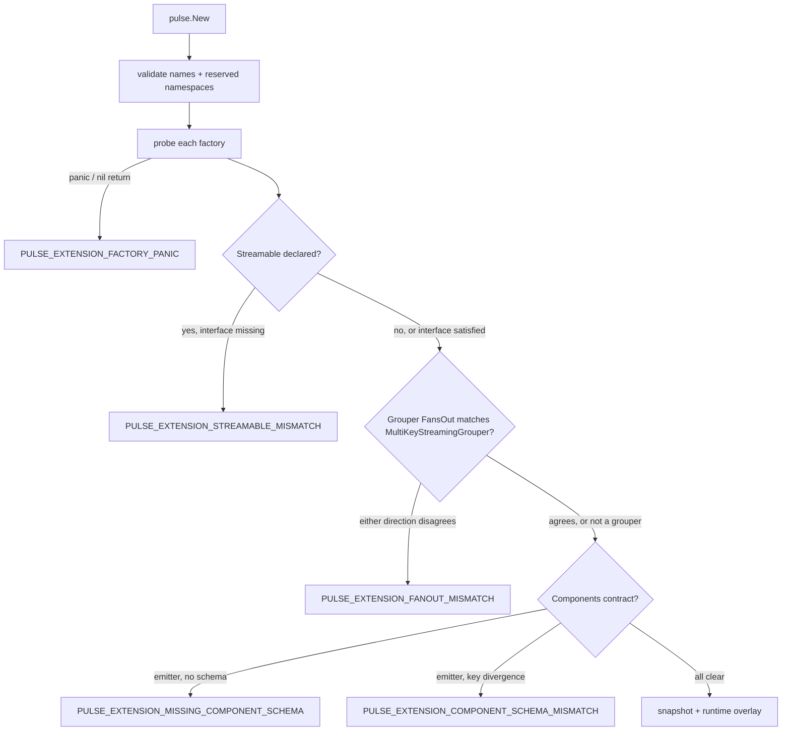

# Extension Points

**Audience:** Pulse embedders writing Go code that calls
`pulse.New(pulse.Options{Extensions: ...})` to inject domain-specific
operators or expression-runtime extensions. If you are adding a new
built-in operator to Pulse itself, see [Adding an
Aggregator](adding-aggregator.md) (and its sibling recipes) instead.

The extension surface is Go-native. There is no plugin loader, no `.so`
files, no hot reload. Registration happens once when the embedding
binary constructs its Pulse instance, and the registration set is fixed
for the lifetime of that instance — restart to change it. Registered
extensions are first-class participants in Predict / Inspect / Process
/ Compose / Manifest: the runtime treats them identically to built-ins,
the manifest advertises them, and the schema-bound MCP tools include
their names in per-category enums.

**You author operators against the public `extend` package** — the
interfaces (`extend.Aggregator`, `extend.Grouper`, …), the read-only
`extend.Record` / `extend.Rows` views and the per-category factory
types. The operator engine itself (`internal/processing/...`) is not
importable by embedders; `extend` imports only `encoding`, `types` and
`errors` (`TestExtendImportBoundary`,
`TestExtendImportBoundary_NoTransitiveEngine`), and no public root
signature names an engine type (`TestRootSurfaceNamesNoProcessing`).
Engine-only capabilities — `MetaWindow`, `ExtensionAware`, `KeyFor`
and the engine's merge hooks (`MergeOnline`, `MergeGrouperState`) —
are deliberately absent from `extend`
(`TestExtendOmitsEngineOnlyCapabilities`); merging is public through
`extend.MergeableAggregator` / `extend.MergeableGrouper`, behind an
explicit `Mergeable` declaration.

The implementation lives in the repository root: `extensions.go`
(public registration types), `extensions_adapt.go` (the adapters that
lift each `extend` operator onto the engine at `pulse.New`),
`extensions_validate.go` (name + registration shape checks),
`extensions_probe.go` (factory probe and components parity),
`extensions_runtime.go` (built-in/extension fold into the runtime
registry), `extensions_snapshot.go` (descriptor-side read-only
projection), and `internal/processing/extensions.go` (the runtime
overlay the engine consults).

## The `extend` contract: `Record`, `Rows` and reuse

`extend.Record` exposes `Schema`, `IsNull`, `NumericValue`,
`StringValue`, `SetMaskValue`, `DecimalValue` and `Weight`; `extend.Rows` exposes
`Len` and `At(i)`. Accessors never return an error — every "no value"
answer is a false second return. The silent cases: `NumericValue` is
false for a null, projected-out or missing field AND for every
`set_*` field (read those with `SetMaskValue`); a categorical field's
`NumericValue` is its dictionary INDEX; `date` is epoch days and
`datetime` epoch seconds; `u64` above 2^53 loses precision through the
float echo; `decimal128` needs `DecimalValue` for exactness.

**Reuse contract.** The engine decodes into reusable buffers, so a
`Record` or `Rows` is valid ONLY for the call that received it. Never
retain one (copy out values; `encoding.SetMask` and
`encoding.Decimal128` are plain values), never mutate anything reachable
from a `Record` including its `*encoding.Schema`. `Record` and `Rows`
are consumer-only: Pulse implements them, embedders call them, and
methods may be added in a minor release.

## Row weights: `WeightAware` and `Record.Weight()`

`AggregatorRegistration`, `AttributeRegistration` and
`TestRegistration` carry `WeightAware bool`, projected as the manifest
extension entry's `weight_aware` (omitted when false). A WeightAware
operator reads the row weight the engine resolved for its slot — slot
`weight` → request `weight` → `pulse.Options.DefaultWeight` — through
`extend.Record.Weight() (float64, bool)`:

- `ok == false` means no weight is in force on the slot (or the
  operator is not WeightAware — every other operator, and every
  filterer, grouper, window and feature, always sees `(0, false)`).
- Only a VALID weight is ever reported: finite and non-negative (zero
  included), and an integer under `kind: frequency`. A row whose weight
  is invalid never reaches a WeightAware aggregator or tier-1 row test —
  it is excluded and counted (`n_weight_invalid`, one
  `PULSE_WEIGHT_INVALID_ROWS` warning per weight column). A WeightAware
  attribute owes every row a value, so it still receives such a row,
  with `Weight()` reporting false.
- The factory sees the resolved weight on its spec (`spec.Weight.Spec()`
  gives `{field, kind}` with the kind spelled out); `nil` when no weight
  applies.
- The orchestrator stamps the weighted floor keys (`sum_weights`,
  `n_eff`, `n_weight_invalid`) on a weighted aggregator slot, exactly as
  for a built-in. The operator never emits them, and they are not
  declared in its `ComponentSchema`.

A registration that does NOT declare `WeightAware` is classed like the
built-ins: an aggregator is skipped under the instance default
(predict reports `skipped_not_weight_aware`, the slot runs unweighted)
and refused with `PULSE_EXTENSION_NOT_WEIGHT_AWARE` under an explicit
slot or request weight; an attribute or test is refused under ANY
weight in force, the instance default included (it may read the whole
population, like the built-in tests and reference attributes). Every
refusal is opted out of with `"weight": null` on the slot. Predict,
manifest and runtime read the same declaration, so they always agree.
A WeightAware extension test is applied, not refused — unlike a
built-in `TEST_*`, the registration has declared its weighted form.

```go
func (a *wsum) UpdateRow(rec extend.Record, field string) error {
	x, ok := rec.NumericValue(field)
	if !ok {
		return nil
	}
	w, weighted := rec.Weight()
	if !weighted {
		w = 1
	}
	a.sum += w * x
	return nil
}
```

Contract long form: `.claude/reference/weighting.md` (Extension
contract).

## When to register vs use a built-in

Use a **built-in** operator when the semantics already ship with Pulse,
or when an `ATTR_FORMULA` plus a custom `ExprFunction` covers the
behaviour. Use a **registered extension** when you need:

- An operator that encodes proprietary business logic that should not
  live in Pulse core (e.g. a domain-specific composite score).
- A closed-form function call from within `ATTR_FORMULA` /
  `FILTER_EXPRESSION` (e.g. `rank_familiarity(value, total_pop)`).
- A static keyed lookup table that drives multipliers or calibration
  factors (e.g. per-`(study, wave)` adjustment).
- Manifest + MCP visibility so LLM agents can discover and invoke your
  operators alongside Pulse built-ins.

## The `Extensions` struct

The full public surface is a single struct on `pulse.Options`:

```go
import "github.com/frankbardon/pulse"

ext := pulse.Extensions{
    Aggregators:        []pulse.AggregatorRegistration{...},
    Attributes:         []pulse.AttributeRegistration{...},
    Filterers:          []pulse.FiltererRegistration{...},
    Groupers:           []pulse.GrouperRegistration{...},
    Windows:            []pulse.WindowRegistration{...},
    Features:           []pulse.FeatureRegistration{...},
    Tests:              []pulse.TestRegistration{...},
    SynthDistributions: []pulse.DistributionRegistration{...},

    ExprFunctions: []pulse.ExprFunction{...},
    LookupTables:  map[string]pulse.LookupTable{...},

    Skills:   skillsFS,   // fs.FS of embedder skill files — see "Embedder skills"
    Examples: examplesFS, // fs.FS of embedder request examples — see "Embedder examples"
}

p, err := pulse.New(pulse.Options{
    FS:         myFs,
    Extensions: ext,
})
```

A zero-value `Extensions` is the no-op case — `pulse.New` behaves
exactly as the unmodified binary. All registrations are validated
together; the first failure short-circuits `pulse.New` with a typed
`CodedError`.

## Naming policy

Embedder registrations MUST use a three-segment namespaced form:

```
<CATEGORY>_<NAMESPACE>_<NAME>
```

The regex enforced by `extensions_validate.go` is:

```
^(AGG|ATTR|FILTER|GROUP|WIN|FEAT|TEST|SYNTH)_[A-Z][A-Z0-9]+_[A-Z](?:[A-Z0-9_]*[A-Z0-9])?$
```

| Example | Category | Namespace | Name |
|---|---|---|---|
| `AGG_ACME_BRAND_SCORE` | aggregator | ACME | BRAND_SCORE |
| `ATTR_ACME_ADJUSTMENT` | attribute | ACME | ADJUSTMENT |
| `FILTER_ACME_GEO_FENCE` | filterer | ACME | GEO_FENCE |
| `TEST_FINANCE_VAR` | test | FINANCE | VAR |

Failure modes raised at registration time:

- Name fails the regex → `PULSE_EXTENSION_NAME_INVALID`.
- Namespace is one of the reserved values `BUILTIN`, `STANDARD`,
  `CORE`, `PULSE` → `PULSE_EXTENSION_NAME_RESERVED`.
- Name collides with a built-in (e.g. registering `AGG_COUNT`) →
  `PULSE_EXTENSION_NAME_COLLISION`.
- The same name appears twice in one `pulse.New` call →
  `PULSE_EXTENSION_DUPLICATE`.

Two embedders in the same process must use disjoint namespaces.

## Per-category registration shapes

The eight operator categories plus expression functions and lookup
tables cover everything `pulse.Options.Extensions` accepts. Field-input
introspection and component-schema emission attach to operator
registrations as additional optional fields — see the dedicated
sections below.

### Aggregator

```go
{
    Name:        "AGG_ACME_BRAND_SCORE",
    Description: "ACME brand composite (0-100).",
    Factory:     acme.NewBrandScoreAggregator,    // extend.AggregatorFactory
    Streamable:  true,                            // factory MUST return extend.OnlineAggregator
    Mergeable:   true,                            // factory MUST return extend.MergeableAggregator; needs Streamable
    MarginReducibility: types.MarginSummable,     // optional: fused crosstab cell; needs Mergeable
    Accepts:     []encoding.FieldType{encoding.FieldTypeF64},
    Params:      []pulse.ParamMeta{{Name: "weights", JSONType: "array"}},
    ComponentSchema: descriptor.ComponentSchema{ /* see below */ },
    ComponentsFunc:  func(instance extend.Aggregator) (map[string]any, error) { /* ... */ },
}
```

When `Streamable=true`, the probe at `pulse.New` time asserts that the
factory's returned value implements `extend.OnlineAggregator`.
Mismatch surfaces as `PULSE_EXTENSION_STREAMABLE_MISMATCH`. The
declaration is authoritative at run time: a `Streamable=false`
aggregator runs buffered even when its value also implements
`extend.OnlineAggregator`, so `PredictResult.Streamable` (which reads
the declaration) and the engine never disagree.

Aggregators are authored against the public `extend` package:
`Aggregate(rows extend.Rows, field)` receives a zero-copy view of the
buffered rows, `UpdateRow(rec extend.Record, field)` one row at a time.
A `Record` / `Rows` is valid only for the call that received it — never
retain one. The adapter installed at `pulse.New` forwards each optional
sibling (`extend.OnlineAggregator`, `extend.RichAggregator`,
`extend.MergeableAggregator`) explicitly, so a streamable aggregator
that also supplies `ComponentsFunc` still streams and merges. Read semantics (null, set, categorical, date/datetime, u64,
decimal128) are on each `extend.Record` method's godoc.

**Decimal128 targets.** The built-in decimal table (exact `AGG_SUM`,
`AGG_AVERAGE`, … — see `skills/financial-cohorts.md`) governs built-ins
only: a built-in outside it is refused on a `decimal128` field
(`PROCESSING_CONFIG` at run time, `PULSE_AGG_NOT_MEANINGFUL_FOR_DECIMAL`
from predict). A registered extension aggregator is never refused — its
factory runs and the extension decides what a decimal field means, reading
the exact value through `extend.Record.DecimalValue` (`NumericValue` is a
rounded echo) and typically rendering it via `extend.RichAggregator`.
Path selection follows the declaration, not the field type: a built-in
over a decimal target always runs buffered (the exact
`AggregateDecimalField` path), but an extension aggregator declaring
`Streamable: true` streams it — **`UpdateRow` sees decimal fields via
`DecimalValue`**, exactly as the buffered `Aggregate` does — and
predict reports the same (`Streamable` from the snapshot, no decimal
reason). The built-in decimal merge refusal does not apply either: a
`Mergeable` extension aggregator merges a decimal target under shard /
decode parallelism like any other field.

**Mergeable.** `Mergeable: true` admits the aggregator to the parallel
reducers — `Options.ShardWorkers` over a shard archive and
`Options.DecodeWorkers` over a large single-file cohort — and to
`ProcessChain` stages. Each worker folds its partition through
`UpdateRow` on a fresh instance; the orchestrator then combines the
partials in a deterministic order with
`extend.MergeableAggregator.Merge(other)` and calls `Finalize`,
`Rich` and `ComponentsFunc` once, on the merged receiver. `other` is
the embedder's own value built by the same factory from the same spec,
so `other.(*myAgg)` succeeds. Merge must be associative; how the
cohort is partitioned depends on the worker count, so a floating-point
fold may differ from the serial answer in the last ULP. The
declaration, not the method set, routes the request: an aggregator
that implements `Merge` but omits `Mergeable` runs serially (and a
chain refuses it). Probe-validation refuses `Mergeable` with
`PULSE_EXTENSION_MERGEABLE_MISMATCH` when the registration is not also
`Streamable` (merge folds online state), when the value does not
implement `extend.MergeableAggregator`, or when `ComponentSchema`
declares keys with `Mergeability: None` — the reducers read
`Components()` off the MERGED instance, so a figure that needs the full
input would be silently wrong. The manifest projects the flag as
`extensions.aggregators[].mergeable`.

**MarginReducibility (fused crosstab cells).** A crosstab whose cell is
an extension aggregator takes the fused in-decode arm
(`processing.CanFuseCrosstab`) only when the registration declares a
margin class — the embedder-side sibling of
`types.AggregationType.MarginReducibility()`: `types.MarginSummable`
(the margin is the sum of the cells), `types.MarginMeanReducible`
(derivable from per-cell value + count) or `types.MarginIndependent`
(set-valued state whose margin is neither a sum nor a re-scan). Any of
the three admits the cell; omitted or `types.MarginRecompute` keeps the
crosstab on the buffered arm, which is what every undeclared extension
cell did before. The class gates ADMISSION only: the fused walk gives
every row, column, grand and cross-axis margin its own instance fed
record by record through `UpdateRow`, exactly as it does for a built-in,
so the class never changes a margin figure — an honest class is still
required, because the manifest and predict read it. A fusable class
requires `Mergeable: true` (and so `Streamable: true`) — the fused gate
holds an extension cell to the built-in cell's mergeable bar — and the
usual fused-gate conditions apply (a `FieldInputs` hook, keyable
groupers, no tests / features / two-pass attributes). Like the decimal
rule above, a decimal128 extension cell fuses on its declaration while a
built-in decimal cell stays buffered. Probe-validation refuses an
unknown class, or a fusable class without `Mergeable`, with
`PULSE_EXTENSION_MARGIN_REDUCIBILITY_MISMATCH`. An extension used as a
`margin_aggregations` AUXILIARY needs no class — an auxiliary is
independent in role — only `Mergeable`. The manifest projects the class
as `extensions.aggregators[].margin_reducibility`, and predict's
`PULSE_CROSSTAB_NORMALIZE_UNSATISFIABLE` advisory reads it from the
snapshot.

### Attribute

```go
{
    Name:        "ATTR_ACME_ADJUSTMENT",
    Description: "Per-(study, wave) multiplier.",
    Factory:     newAdjustmentAttribute,           // extend.AttributeFactory
    Mode:        pulse.AttributeModeRowLocal,       // row_local | two_pass | buffered
    Accepts:     []encoding.FieldType{encoding.FieldTypeF64},
    Emits:       pulse.AttributeEmitFloat64,
}
```

`Mode` drives streaming-tier validation: `row_local` requires
`extend.RowLocalAttribute` (`Row(rec extend.Record, field)`),
`two_pass` requires `extend.TwoPassAttribute` (adds `PrePass` +
`Finalize`), `buffered` requires only the base
`extend.AttributeComputer` (`Compute(rows extend.Rows, field)
([]float64, error)`, one value per row, aligned with `rows`). The probe
asserts the `extend` sibling on the factory's own value; the adapter
forwards exactly the tier it implements. Attributes do NOT declare a
`ComponentSchema` (see the table in the **Component schemas** section).
`Mode` also picks the run-time drive on `Process`: `row_local` streams
through `Row`, `two_pass` takes the streaming `PrePass` → `Finalize` →
`Row` drive, `buffered` runs `Compute` over the materialised rows. Like
the built-in two-pass attributes (`ATTR_ZSCORE`, …), a `two_pass`
extension runs buffered when the request also carries a grouper,
feature, regression or tier-1 test.
On the streaming drive every attribute runs in declared order, so a
`two_pass` attribute can read an earlier attribute's label: the engine
learns which earlier labels it reads from `Field` plus its
`FieldInputs` hook. Without the hook it assumes the attribute reads
every earlier attribute — still correct, but each earlier `two_pass`
attribute then costs an extra scan.

### Filterer, Grouper, Window, Feature

All four follow the same envelope: name, description, factory, accepted
types, params metadata. `FiltererRegistration` and `GrouperRegistration`
additionally carry `ComponentSchema` + `ComponentsFunc` on the same
contract as `AggregatorRegistration`. Filterers are always row-local
streamable; windows always run buffered.

`GrouperRegistration` additionally carries `FansOut bool` — the
embedder-side sibling of `types.GroupType.FansOut()`, which knows
built-in constants only. Set it `true` when the factory returns a
value that also implements `extend.MultiKeyStreamingGrouper`
(`KeysForRow`), i.e. when one record can land in more than one bucket.
Consumers that reason about per-record denominators need the fact:
under a fan-out grouper the bucket counts SUM to more than the record
total, so an `n` taken from a slab total double-counts records. The
probe verifies the claim in BOTH directions
(`PULSE_EXTENSION_FANOUT_MISMATCH`), and omitting the field defaults it
to `false` — so a multi-key factory is refused rather than silently
admitted as single-key.

Groupers and filterers are authored against `extend` too. A grouper's
buffered `Group(rows extend.Rows, field)` returns
`map[string][]int` — row INDICES into `rows`, which the adapter maps
back to the engine's records (an out-of-range index is a
`PROCESSING_INTERNAL` coded error, never a panic). The streaming
siblings are `extend.StreamingGrouper` (`KeyForRow`) and
`extend.MultiKeyStreamingGrouper` (`KeysForRow`); returning
`extend.ErrGrouperKeyNull` from either is the same as `ok=false` — the
row lands in no bucket. A filterer is an `extend.FiltererFactory`
returning an `extend.FiltererBuilder` whose `Build` compiles an
`extend.FilterFunc func(extend.Record) (bool, error)`. The adapter
forwards each keying sibling explicitly, so a fan-out grouper that also
supplies `ComponentsFunc` stays multi-key (and fuses in a crosstab).
A single-key `extend.StreamingGrouper` fuses too: the adapter binds the
`types.Group.Field` the factory was built for and synthesizes the
engine-only field-bound `KeyFor` from your `KeyForRow`, so your method
always receives the real field name. The fused gate reads the
DECLARATION: a crosstab axis grouper fuses iff its registration
declares `Streamable=true` or `FansOut=true` (both probe-validated, so
the keying sibling is guaranteed). This is a deliberate change — the
gate used to probe the constructed value's interface, so a
`Streamable=false` grouper implementing `KeyForRow` fused; it now runs
the buffered crosstab arm, with identical output and only peak heap
differing, because `pulse predict` (`PredictResult.CrosstabFusable`)
can read only the declaration and both sides run one rule. Declare
`Streamable=true` to keep such a grouper on the fused arm.
`Streamable=true` routes the grouped `Process` request onto the
streaming path, driving `KeyForRow` / `KeysForRow` per row; the probe
refuses a `Streamable=true` registration whose value implements
neither keying sibling (`PULSE_EXTENSION_STREAMABLE_MISMATCH`). A
`Streamable=false` grouper runs buffered through `Group` even when it
can key per row.

**Mergeable groupers.** `Mergeable: true` (with `Streamable: true`)
admits the grouper — single-key or fan-out — to the parallel reducers
(`ShardWorkers`, `DecodeWorkers`) and to ProcessChain stages. Each
partition gets its own instance keyed through `KeyForRow` /
`KeysForRow`; the engine merges the per-key aggregator buckets and
sums the (record, bucket) assignment count behind the
`{total_n, n_null}` floor itself. What it cannot merge is your
components state, so a grouper that EMITS components (`ComponentsFunc`,
or its own `Components()` method) must implement
`extend.MergeableGrouper.MergeState(other)`: fold `other`'s counters
into the receiver — `other` is your own value from the same factory
and spec — and `ComponentsFunc` then runs once, on the merged receiver.
A grouper that emits no components needs no method; the adapter folds
nothing. Probe-validation refuses `Mergeable` without `Streamable`, an
emitting value without `MergeState`, and `ComponentSchema` keys
classified `None` (`PULSE_EXTENSION_MERGEABLE_MISMATCH`). The flag
reaches the manifest as `extensions.groupers[].mergeable`. Omitted,
grouped requests naming the grouper run serially and a chain refuses
it.

A window is an `extend.WindowFactory` taking the spec and an empty
`extend.WindowOptions` and returning an `extend.WindowComputer`
(`Compute(rows []map[string]any, partitions [][]int, label string)`);
it writes its column into the materialised result rows in place.

A feature is an `extend.FeatureFactory` returning an
`extend.FeatureComputer`: `Compute(rows extend.Rows, field)` returns
`map[string]extend.FeatureOutput` keyed by output column, each
`{Values, Nulls}` aligned with `rows`. The optional streaming sibling
`extend.StreamingFeatureComputer` (`PrePass`, `Finalize`, `EmitRow`)
returns single-row outputs from `EmitRow`; any other shape is a
`PROCESSING_INTERNAL` coded error. Features only READ rows — the engine
writes the derived columns. Feature streamability is decided on the
returned value (the adapter exposes the streaming sibling iff the
embedder's value implements it), so a streaming extension feature does
stream on `Process`.

### Test (tier-1 / tier-2)

```go
// Tier-1 (folds during streaming aggregation pass):
{
    Name:       "TEST_ACME_PROXY",
    Tier:       pulse.TestTierRow,
    RowFactory: newProxyRowTest,                  // extend.RowTestFactory
    Streamable: true,
}

// Tier-2 (runs over materialised result rows after windows):
{
    Name:        "TEST_ACME_AGGREGATE_CHECK",
    Tier:        pulse.TestTierPost,
    PostFactory: newAggregateCheckPostTest,       // extend.PostTestFactory
}
```

Exactly one of `RowFactory` / `PostFactory` must be non-nil and match
`Tier`. A tier-1 `extend.RowTest` folds `UpdateRow(rec extend.Record)`
then `Finalize() (*types.TestResult, error)`; a tier-2 `extend.PostTest`
runs `Run(rows []map[string]any)` once over the result rows. Tier-2
tests always run buffered; `Streamable` on a tier-2 registration is
ignored. A tier-1 test declared `Streamable=true` co-streams with
online aggregators (`UpdateRow` folds during the single pass);
`Streamable=false` forces the request buffered.

An extension `TEST_*` joins multiple-comparison families exactly like a
built-in: its headline `PValue` is one member of the `request` (or
`compose`) family under the resolved `multiplicity` block, and the fold
adds `p_adjusted`, `significant_adjusted` and `multiplicity` to its
`TestResult`. The registration declares nothing for it.

### Synth distribution

Reserved for embedders shipping bespoke samplers. There is no `extend`
factory shape for it yet; the registration validates name + duplicates
and reserves the namespace.

### Expression functions

Custom Go functions become callable from `ATTR_FORMULA` and
`FILTER_EXPRESSION`:

```go
{
    Name:        "rank_familiarity",
    Description: "ACME brand familiarity rank.",
    Signature:   "rank_familiarity(value float64, total_pop bool) float64",
    Fn:          acme.RankFamiliarity,
    Pure:        true,        // declares side-effect-free; reserved for future memoisation
}
```

Pulse passes `Fn` to expr-lang's `expr.Function(name, fn)`. expr-lang
accepts typed functions via reflection — `func(v float64) float64` and
`func(args ...any) (any, error)` both work. Use the variadic shape
when zero-allocation calling matters.

### Lookup tables

Static keyed tables exposed via the built-in `lookup(table, keys...)`
function:

```go
LookupTables: map[string]pulse.LookupTable{
    "adjustments": {
        Description: "Per-(study, wave-date) calibration multipliers.",
        // Rows is the simple path — caller-joined composite key.
        Rows: map[string]float64{
            "study_a|2025-01-01": 1.07,
            "study_a|2025-02-01": 1.12,
        },
        // OR — Lookup is the escape hatch:
        // Lookup: func(keys ...string) (float64, bool, error) { ... }
    },
},
```

Exactly one of `Rows` / `Lookup` must be non-nil; validation at
`pulse.New` returns `PULSE_EXTENSION_PARAM_INVALID` otherwise.
`Rows`-backed tables join keys with `|` before indexing. The `Lookup`
function-backed path receives the key slice directly — compose keys
however you want, perform partial-match fallback, or pull from an
external store.

At evaluation time `lookup()` raises `PULSE_LOOKUP_TABLE_UNKNOWN` for
an unregistered table and `PULSE_LOOKUP_MISS` for a missing key. Both
wrap into `PROCESSING_RUNTIME` when surfaced through `ATTR_FORMULA` /
`FILTER_EXPRESSION` — use `errors.HasCode(err, errors.PULSE_LOOKUP_MISS)`
to detect inside the chain.

## Component schemas (v0.20.0)

`Response.Components` is the operator-keyed sibling payload that runs
alongside `Response.Data`. Every aggregator, grouper, and filterer in
a request lands a typed map under
`Response.Components.Aggregations[i].Operator`, `.Groupers[i].Operator`,
or `.Filterers[i].Operator`. Embedder-registered operators participate
via two coupled optional fields on `AggregatorRegistration`,
`GrouperRegistration`, and `FiltererRegistration`. The universal
contract — typed shells, floor keys, additive `omitempty` shape —
lives in
[`skills/response-components.md`](https://github.com/frankbardon/pulse/blob/main/internal/skills/response-components.md);
this section covers only the extension-side wiring.

### Which categories declare a `ComponentSchema`?

| Category | Declares `ComponentSchema`? | Notes |
|---|---|---|
| Aggregator | Yes | Universal floor `{n, n_null}` filled by orchestrator. |
| Grouper | Yes | Universal floor `{total_n, n_null}` filled by orchestrator. |
| Filterer | Yes (floor-only valid) | Universal floor `{n_in, n_out, n_null_input}` filled by orchestrator; in v1 no built-in filterer adds operator-specific keys. |
| Attribute | No | Attributes do not flow into `Response.Components`. |
| Window | No | Window outputs land in `Response.Data` rows. |
| Feature | No | Pre-filter; no components surface. |
| Test | No | Test results carry their own typed shape. |
| Synth | No | Generators, not aggregations. |

A registration in a category that does not declare a `ComponentSchema`
silently ignores the field if you set it.

### Declaration shape

```go
type ComponentSchema struct {
    Keys         []ComponentKey
    Mergeability ComponentsMergeability   // Mergeable | Partial | None
}

type ComponentKey struct {
    Name        string  // snake_case, matches the runtime emission key
    Type        string  // "int" | "float64" | "string" | "map" | "array" | "object"
    Description string  // surfaces in manifest + MCP schema
}
```

`Keys` is the canonical declared set. Names use snake_case (matches
every other Pulse JSON key — `n_null`, `mode_count`, `range_min`).
`Type` is a JSON-shape declaration that flows through to the manifest
and schema-bound MCP tools; `Description` is the one-liner shown in
LLM-bootstrap output.

The orchestrator owns the universal floor keys; the embedder's
`ComponentsFunc` returns ONLY operator-specific keys. Two conventions
for what goes in `Keys` are tolerated by the probe — either list both
floor and operator-specific keys (so a manifest reader sees the full
payload shape), or list only operator-specific keys (the convention
used by built-ins, where readers compose with the per-category floor
table). The runtime contract is the same either way.

### Mergeability axis

`ComponentsMergeability` declares how the components state composes
when multiple chunks (streaming) or shards (parallel) flow into a
single aggregator:

| Value | Meaning | Examples |
|---|---|---|
| `Mergeable` | Stream-safe. State composes through the same `MergeOnline` path as the scalar value. Streaming chunks carry `ComponentsDelta`; consumers reconcile. | Welford-family (sums, sums-of-squares), running counts, set masks, weighted accumulators. |
| `Partial` | Unions across chunks but at non-trivial allocation cost — map / set unions where the merge is associative but not constant-space. The orchestrator may stage the merge at terminal flush. | `AGG_MODE_COUNT`, `AGG_MODE`, `AGG_DISTINCT_COUNT`, `AGG_DISTINCT_SUM`. |
| `None` | Terminal-only. Needs sorted full input. Streaming chunks omit components entirely; only the terminal buffered flush emits. Predict declares the slot buffered-components-only. | `AGG_MEDIAN`, `AGG_PERCENTILE`. |

Choose the axis that matches the math, not the convenience of the
registration site. Declaring `Mergeable` on an operator whose state
cannot actually fold produces silently-wrong components in parallel
shard processing — there is no runtime gate for the math, only the
streaming-tier wiring. For an aggregator or grouper the components
class is separate from the registration's `Mergeable` flag (which
decides whether the operator merges at all), but the two must agree: a
`Mergeable` aggregator or grouper whose components class is `None` is
refused at `pulse.New` (`PULSE_EXTENSION_MERGEABLE_MISMATCH`).

### Two emission paths: `ComponentsFunc` and `Components()`

There are two equivalent ways to surface operator-specific keys at
runtime; pick whichever fits your operator type.

**`ComponentsFunc` closure (the registration-level path).** Supply a
closure on the registration; the runtime wraps the factory return
value so the orchestrator can find it:

```go
pulse.AggregatorRegistration{
    Name:    "AGG_ACME_BRAND_SCORE",
    Factory: acme.NewBrandScoreAggregator,
    Streamable: true,
    Accepts: []encoding.FieldType{encoding.FieldTypeF64},
    ComponentSchema: descriptor.ComponentSchema{
        Keys: []descriptor.ComponentKey{
            {Name: "weighted_sum", Type: "float64", Description: "Running weighted sum."},
            {Name: "weights_applied", Type: "int", Description: "Weight multipliers fired."},
        },
        Mergeability: descriptor.Mergeable,
    },
    ComponentsFunc: func(instance extend.Aggregator) (map[string]any, error) {
        a := instance.(*brandScoreAggregator)
        return map[string]any{
            "weighted_sum":    a.WeightedSum(),
            "weights_applied": a.WeightsApplied(),
        }, nil
    },
}
```

The closure signatures, defined in `extensions.go`, are:

```go
type AggregatorComponentsFunc func(instance extend.Aggregator)         (map[string]any, error)
type GrouperComponentsFunc    func(instance extend.Grouper)             (map[string]any, error)
type FiltererComponentsFunc   func(instance extend.FiltererBuilder)     (map[string]any, error)
```

The orchestrator invokes each func ONCE after the operator's terminal
pass (post-`Aggregate`/`Finalize` for aggregators; post-partition for
groupers; post-eval for filterers). Returning `(nil, nil)` is the
canonical signal for "no operator-specific keys; the orchestrator's
universal floor is the entire payload" — the floor-only shape.

**Self-emitting operators (the type-level path).** If the value your
factory returns already has a `Components() (map[string]any, error)`
method, you may leave `ComponentsFunc` nil — the adapter adopts the
method as the emitter, for aggregators, groupers and filterers alike.
An explicit `ComponentsFunc` wins over the method. This holds for every
emitting category, and it is an intentional, documented deviation from a
strict "emission only through `ComponentsFunc`" reading: an operator's
own `Components()` method still emits when no `ComponentsFunc` is
registered.

Probe-validation asserts emitted keys against `ComponentSchema.Keys`
only for an explicit `ComponentsFunc`; a self-emitting `Components()`
method is NOT probe-validated (it is not invoked at `pulse.New`), so
prefer `ComponentsFunc` when you want that check. Use `ComponentsFunc` too when the factory returns a third-party
type you cannot extend.

### Floor-only registrations

If both `ComponentSchema.Keys` is empty and `ComponentsFunc` is nil
(and the factory's return value does NOT implement the sibling
interface), the registration is **floor-only**: the orchestrator emits
the universal floor keys for that category and nothing else. This is
valid and supported, and it is the most common shape for filterer
extensions today — no built-in filterer adds operator-specific keys.
For aggregators it suits simple counter-style operators that do not
need to surface internal state. The probe does NOT reject this shape.

```go
pulse.AggregatorRegistration{
    Name:    "AGG_ACME_COUNT_NONNEG",
    Factory: newNonNegCountAgg,
    // No ComponentSchema, no ComponentsFunc — Response.Components carries
    // only {"n": ..., "n_null": ...}.
}
```

### Probe-validation parity check

The probe at `pulse.New` (see `extensions_probe.go`) exercises each
factory once against a minimal synthetic schema, then asserts the
components contract for AGG / GROUP / FILTER registrations:

| Condition | Error code |
|---|---|
| `ComponentsFunc` set (or the value's own `Components()` method adopted) but `ComponentSchema.Keys` empty | `PULSE_EXTENSION_MISSING_COMPONENT_SCHEMA` |
| `ComponentsFunc` returns a key NOT present in `ComponentSchema.Keys` (after the floor-tolerance carve-out), or order diverges from the declared order | `PULSE_EXTENSION_COMPONENT_SCHEMA_MISMATCH` |
| `ComponentsFunc` returns a universal-floor key the orchestrator owns | `PULSE_EXTENSION_COMPONENT_SCHEMA_MISMATCH` |

Fetch the Message + Fixup template via `pulse errors lookup <CODE>`
(CLI) or call `pulse_errors_lookup` from an MCP session.

## Probe validation (full surface)

The probe (`extensions_probe.go`) runs after schema + name validation
and before `pulse.New` returns. For every aggregator, attribute,
grouper, and filterer registration it constructs the factory once
against a minimal synthetic schema and asserts:


```mermaid
flowchart TD
    A[pulse.New] --> B[validate names + reserved namespaces]
    B --> C[probe each factory]
    C -->|panic / nil return| F1[PULSE_EXTENSION_FACTORY_PANIC]
    C --> D{Streamable declared?}
    D -->|yes, interface missing| F2[PULSE_EXTENSION_STREAMABLE_MISMATCH]
    D -->|no, or interface satisfied| D2{Grouper FansOut matches MultiKeyStreamingGrouper?}
    D2 -->|either direction disagrees| F5[PULSE_EXTENSION_FANOUT_MISMATCH]
    D2 -->|agrees, or not a grouper| E{Components contract?}
    E -->|emitter, no schema| F3[PULSE_EXTENSION_MISSING_COMPONENT_SCHEMA]
    E -->|emitter, key divergence| F4[PULSE_EXTENSION_COMPONENT_SCHEMA_MISMATCH]
    E -->|all clear| G[snapshot + runtime overlay]
```

Factory contract for the probe (documented in `extensions_probe.go`):
embedder factories MUST tolerate a nil/empty `Schema` and a spec
carrying only the operator `Name`. The probe never feeds real records.
A `WeightAware` aggregator, attribute or test factory is constructed a
second time with a row weight on its spec (a field the empty schema
does not carry) and must pass the same checks; a failure of that
construction reports the same code with `details.weighted: true`.
Tests are probed only when they declare `WeightAware`.

Factory panics or nil returns surface as
`PULSE_EXTENSION_FACTORY_PANIC`. Streamability declarations that do
not match the returned interface surface as
`PULSE_EXTENSION_STREAMABLE_MISMATCH`. A grouper whose `FansOut`
declaration disagrees with whether its factory returns
`extend.MultiKeyStreamingGrouper` — in EITHER direction — surfaces
as `PULSE_EXTENSION_FANOUT_MISMATCH`; a factory panic is caught first,
so a panicking factory never reports a fan-out mismatch. The
components-contract failures are listed in the table above.

## Manifest visibility and the extensions snapshot

`pulse manifest --json` and `pulse_manifest` include a top-level
`extensions` block whenever the host registered anything:

```json
{
  "format_version": "1.1",
  "components": { ... built-ins ... },
  "extensions": {
    "aggregators": [
      {"name": "AGG_ACME_BRAND_SCORE", "namespace": "ACME", "streamable": true, "...": "..."}
    ],
    "groupers": [
      {"name": "GROUP_ACME_PANEL", "namespace": "ACME", "streamable": true, "fans_out": true}
    ],
    "expr_functions": [
      {"name": "rank_familiarity", "signature": "rank_familiarity(value float64, total_pop bool) float64"}
    ],
    "lookup_tables": [
      {"name": "adjustments", "has_rows_data": true}
    ]
  }
}
```

The plumbing that fills that block is the **extensions snapshot**
(`extensions_snapshot.go`). `buildExtensionsSnapshot(ext)` translates
the public `Extensions` struct into the read-only
`internal/descriptor.ExtensionsSnapshot` projection (`internal/descriptor`; not
importable by embedders — the facade fills it). The snapshot is passed
into `internal/descriptor.PredictOptions.Extensions` and into
`mcp.BindWithExtensions` (`internal/mcp`; `mcp/gosdk` reaches the
instance's snapshot through the `internal/facadebridge` hook) so the descriptor layer stays
free of `internal/service/` and `internal/processing/` imports — the no-execute
contract for `internal/descriptor/` remains intact, and predict / manifest
treat custom operators identically to built-ins.

LLM agents that call `pulse_manifest` see both the built-in set and
the embedder additions in one fetch. The schema-bound MCP tools (after
`pulse_inspect`) also include custom operator names in their enum
lists.

### The snapshot carries `fans_out` and `mergeable`

`OperatorMeta.Mergeable` (`json:"mergeable,omitempty"`) projects the
aggregator / grouper `Mergeable` declaration the same way, and
`OperatorMeta.MarginReducibility` (`json:"margin_reducibility,omitempty"`)
the aggregator's declared crosstab margin class (predict's normalize
advisory reads it through
`ExtensionsSnapshot.AggregatorMarginReducibility`). The
predict-side chain gate reads it:
`internal/descriptor.ValidateChainWithExtensions` admits an extension
aggregator or grouper on its declared `Mergeable` flag and a
`row_local` extension attribute as row-local and an extension filterer
on its `Streamable` flag — the same `internal/mergegate.ChainRefusal`
call the runtime gate makes over the `ExtensionRegistry`, so the answers
cannot drift — while `ValidateChain` (the nil-snapshot case) knows
built-ins only.

`descriptor.OperatorMeta` carries `FansOut bool`
(`json:"fans_out,omitempty"`) alongside `Streamable`, and
`buildExtensionsSnapshot` fills it from
`GrouperRegistration.FansOut`. It is grouper-only and omitted
everywhere else; absent reads as `false`, which is also the
registration default.

This is not cosmetic manifest detail — it is the only route the fact
has into the no-execute layer. `internal/descriptor/` may not import
`internal/processing/` (`TestPredictNoExecutionImports`), so predict cannot
assert `MultiKeyStreamingGrouper` on a constructed grouper the way the
probe does. Without the projection, a predict-time rule that reasons
about per-record denominators sees every extension grouper as
single-key.

The consumer today is the distinct-key slab partition gate on the
`OVERLAY_PAIRWISE_*` family (`params.n_source = "n_within_distinct"`),
which refuses a pair axis whose summed-across dims include a fan-out
grouper, because summing per-cell DISTINCT counts over cells that do
not partition the key set over-states `n`. Both arms of that gate
resolve a grouper the same way:

1. a built-in constant answers from `types.GroupType.FansOut()`;
2. anything else asks the extension side — the snapshot at predict
   (`ExtensionsSnapshot.GrouperFanOut`), the live registry at runtime
   (the engine's extension registry, fed by the registration's
   `FansOut`);
3. a name in NEITHER passes. It cannot execute — the runtime refuses
   to build an unknown group type — so no wrong number can come of it,
   and refusing here would bury the accurate unknown-operator error
   under a partition diagnostic about a grouper that does not exist.

Two sources, one order: `types.CheckPairwiseSlabPartitionWith` owns
steps 1–3 and each arm supplies only its own step-2 resolver, so
predict and runtime cannot drift on the same request. The
runtime registry's fan-out map holds an entry for every registered
grouper including the `false` ones, so a missing key means
"registered nowhere" rather than "declared single-key".

Because the probe already verified the declaration against the factory
at `pulse.New` (`PULSE_EXTENSION_FANOUT_MISMATCH`), both arms trust it
without reconstructing the grouper — which matters for the runtime
arm, whose overlay hook has no schema in reach.

## DependsOn (feature-profile dependencies)

Every operator registration (aggregator, attribute, filterer, grouper,
window, feature, test) accepts an optional `DependsOn []string`: the
features the operator needs. Each entry is an AND edge — a
[feature profile](../library/feature-profiles.md) that enables the
operator must enable every named feature too, or `pulse.New` fails with
`PULSE_FEATURE_PROFILE_DEPENDENCY`. Every enabled extension operator
also needs a request host (`capability:process`, `capability:compose`
or `capability:process_chain`), exactly like a built-in.

```go
pulse.AggregatorRegistration{
    Name:      "AGG_ACME_SPREAD",
    DependsOn: []string{"AGG_WELFORD"}, // reads AGG_WELFORD's components
    Factory:   newSpread,
}
```

Entries use profile spelling: operators bare, everything else
`<kind>:<name>` (`capability:crosstab`, `io_format:csv`). Each must name
a feature this build knows — a built-in or another registered extension
operator — and that is checked at **every** `pulse.New`, with or
without a profile, so a typo fails at construction with
`PULSE_FEATURE_PROFILE_UNKNOWN` (each entry carries `extension` and
`category`). Extension operators carry no `Since` and are listed in a
profile by their registered name. Synth-distribution registrations have
no `DependsOn`: distributions are not features (`capability:synth`
gates them all).

## Purpose and Interpretation (guidance metadata)

Every registration — all seven operator categories plus synth
distributions — accepts an optional `Purpose *descriptor.Purpose`: the
same plain-language guidance built-ins declare (what the operator is
for, the intents it answers, when to reach for something else, its
assumptions). A `TestRegistration` additionally accepts
`Interpretation []descriptor.Interpretation`, saying how to read each
output field.

```go
pulse.AggregatorRegistration{
    Name:    "AGG_ACME_BRAND",
    Factory: newBrand,
    Purpose: &descriptor.Purpose{
        Plain:     "Composite brand health score for a set of respondents.",
        Intents:   []string{"measure_construct"},
        Questions: []string{"How healthy is our brand this wave?", "Which segment rates it highest?"},
        UseCases:  map[descriptor.Domain]string{descriptor.DomainSurvey: "Brand tracker across waves."},
        NotFor:    []descriptor.Alternative{{When: "you need one rating's plain average", Use: "AGG_AVERAGE"}},
        Level:     descriptor.LevelIntermediate,
    },
}
```

**Validation.** At every `pulse.New` (and `CheckFeatureProfile`), after
the probe and the `DependsOn` check, a present `Purpose` runs the exact
rules the built-in tier does: `Plain` non-empty and at most 140
characters; at least one intent, each in the taxonomy (`pulse.Intents()`)
and listed once; at least two `Questions`; at least one `NotFor` entry,
each with a `When` and a `Use` that is not the operator itself and
resolves against the **instance** registry — a built-in operator, any
other registered extension, or a `<kind>:<name>` feature-table row;
`UseCases` keyed by `survey` / `ops` / `science` / `harness`; `Level`
one of `basic` / `intermediate` / `advanced`; `Glossary` IDs from
`pulse.Glossary()`, listing every jargon term `Plain` uses. An
`Interpretation` is checked for **structure only** — path syntax,
`Means` or a known `Shared` rule set, `Bands` with a `Convention`,
`Sign` keys `+` / `-` — since an extension declares no output keys to
probe. The first registration that breaks a rule (category order, then
slice index; `Purpose` before `Interpretation`) fails with
`PULSE_EXTENSION_PURPOSE_INVALID`; details carry `category`, `name`,
`index`, `part` (`purpose` / `interpretation`), the first failing
`rule`, and every `rules` / `violations` entry.

**Projection.** Only a Purpose's sorted intent IDs reach the manifest,
as the extension entry's `intents` list; the prose never rides a
default payload. An absent Purpose projects no `intents` key and leaves
the operator out of guidance coverage. The extensions snapshot carries
the validated Purpose and Interpretation for later surfaces, and an
extension a feature profile hides drops its guidance with it.

## FieldInputs hook (buffered-projection introspection)

Every operator registration accepts an optional `FieldInputs`
callback:

```go
type FieldInputsFunc func(raw json.RawMessage) []string
```

Buffered-decode projection is **default-on** (output-transparent —
same result, only faster; opt out with `pulse.Options{DisableProjection: true}`
or the `--no-project` CLI flag on `pulse api process` only —
`process-chain` / `compose` do not expose it in v1). `pulse.Options.ProjectBufferedFields`
is retained but deprecated (a harmless no-op). While projection is
active, the runtime walks each request before opening the streaming
iterator and calls
the engine's field-needs extractor (`internal/processing`, not
embedder-reachable) to compute the set of source fields the operators actually read. Built-in operators are
fully introspectable from their spec (`Field`, `Field2`,
`PartitionBy`, `OrderBy`, `Target`, `Predictors`, plus expr-AST
identifiers for `ATTR_FORMULA` / `FILTER_EXPRESSION`). Custom
operators registered through this surface are opaque by default —
without a `FieldInputs` hook, the projection extractor widens the
retained set to "every field" so the runtime stays correct.

A built-in whose **`Params` name a schema field** is the one shape
introspection does not get for free, because the name lives nowhere on
the operator's own struct. `addAggParamFields` is the built-in
counterpart of `FieldInputs` and must gain an arm on the same day such
an operator does — `AGG_DISTINCT_SUM`'s `distinct_by`,
`AGG_WEIGHTED_MEAN`'s `weight_field`, `AGG_RATIO`'s
`numerator_field` / `denominator_field`, `FEAT_TRAIN_TEST_SPLIT`'s
`stratify` and `FEAT_TARGET_ENCODE`'s `target` are the whole set
today, and the field-reference rule (`aggParamFieldKeys` in
`internal/descriptor/field_refs.go`) must gain the same arm so an
unknown name there is refused rather than read as all-null. **Forgetting one fails silently, not loudly:** the field is
decoded onto no `Record`, `Record.NumericValue` answers `ok=false` for
it on every row, and the operator reads that as a missing input rather
than as a broken request — so the request succeeds and publishes a
confident zero, with `n_null` equal to the full admitted record count
as the only signature.

The extractor must also walk **every request slot that can carry an
operator**, not merely the well-known ones. `Crosstab.MarginAggregations`
is the slot that has been missed once: auxiliary margin-only
aggregations read source records exactly as `Crosstab.Cell` does and
contribute to the projection exactly as it does, both their own `Field`
and their `Params` fields, and an opaque extension aggregator sitting
there widens the set exactly as one sitting in `Crosstab.Cell` would.

To let projection narrow past your custom operator (instead of
widening to "every field"), register `FieldInputs` and return every
schema field the operator reads beyond its spec's explicit
references:

```go
pulse.AggregatorRegistration{
    Name:    "AGG_ACME_BLENDED_SCORE",
    Factory: blendedScoreFactory,
    Params:  []pulse.ParamMeta{{Name: "weight_field", JSONType: "string"}},
    // Spec.Field carries the value field; weight_field names a second
    // numeric field. Both must be in the projected map for the
    // aggregator to compute correctly.
    FieldInputs: func(raw json.RawMessage) []string {
        var p struct {
            WeightField string `json:"weight_field"`
        }
        _ = json.Unmarshal(raw, &p)
        if p.WeightField == "" {
            return nil
        }
        return []string{p.WeightField}
    },
}
```

Return-value semantics:

- `nil` or empty slice: no extra fields beyond the spec's `Field`.
- Every returned name is also **validated**: the hook rides the
  read-only extensions snapshot, and the shared field-reference rule
  (the one predict, the Compose / chain validators and the runtime all
  apply before a record is read) judges each declared name against the
  columns available at the operator's pipeline point — schema fields,
  earlier feature outputs and attribute labels, or, for a window, the
  output row columns. A name nothing produces is refused with
  `SERVICE_VALIDATION`
  `"<category> <NAME>: FieldInputs references unknown field <f>"`,
  details `{field, <slot>, field_inputs: true}`, identically on both
  sides. So return exactly the names the operator reads — never a
  speculative superset. A hook that panics is treated as undeclared
  (nothing judged), not as a crash. The projection extractor itself
  still drops non-schema names, so a declared derived column costs
  nothing there.
- Errors are not part of the signature on purpose — `FieldInputs`
  runs on the hot path and should be allocation-free. Anything that
  needs decoding belongs in the factory.

For filterers the callback receives `nil` as `raw` (filterers do not
carry a Params block today). Tier-2 post-tests do not decode source
records and should leave `FieldInputs` nil.

The hook is plumbed via `buildRuntimeExtensions` into the engine's
internal extension registry, keyed by category and name. The lookup
reports "callback ran" when the callback is registered and "none" when
the operator is custom but has no callback — that second case is what
triggers the extractor to widen.

The retained set the extractor returns feeds
`internal/encoding.BuildDecodePlan(schema, retained)`. A registration **with** `FieldInputs`
participates normally — its contributed fields land in the retained
set and the plan emits `SkipBytes` segments for every contiguous
unprojected run, so unread byte ranges advance with a single `Seek`.
A registration **without** `FieldInputs` widens the retained set to
`*`, producing a full-coverage plan with no `SkipBytes` segments.
Both shapes are correct; only the plan-driven one elides byte
ranges.

## Streamability contract

Embedders declare streamability at registration time; the runtime
routes on that declaration — never on the built-in per-type
`Streamable()` tables (which know no extension name) nor on whichever
optional interface the value happens to carry — and predict reads the
same declaration from the extensions snapshot, so
`PredictResult.Streamable` agrees with the path taken
(the engine's internal streamability gate is the runtime parity hook;
`TestExtensions_StreamabilityFollowsDeclaration` holds all three equal).
Use `Predict` and read `PredictResult.Streamable` to learn the path
before running. Probe-validation guarantees every streamable declaration is
backed by the interface in the table below
(`PULSE_EXTENSION_STREAMABLE_MISMATCH`); for a tier-1 test the flag
alone decides, since every `extend.RowTest` folds per row. Feature
streamability is the exception: it is decided on the returned value.

| Category | Streamable means | Required interface |
|---|---|---|
| Aggregator | one-pass online | `extend.OnlineAggregator` |
| Attribute (`row_local`) | per-row eval, no PrePass | `extend.RowLocalAttribute` |
| Attribute (`two_pass`) | PrePass + Finalize + Row | `extend.TwoPassAttribute` |
| Grouper | derive key from a single row | `extend.StreamingGrouper` (fan-out: `extend.MultiKeyStreamingGrouper`) |
| Feature | StreamingComputer pipeline | `extend.StreamingFeatureComputer` |
| Test (tier-1) | folds with online aggregators | `extend.RowTest` |

Filterers are always row-local streamable; windows always run
buffered.

## Limits of extension operators

State these plainly to users rather than discovering them at run time:

- **Merging is opt-in.** An extension aggregator or grouper merges
  only when its registration declares `Mergeable` (see Aggregator and
  Grouper above); extension filterers and `row_local` attributes merge
  as row-local operators; `two_pass` / `buffered` attributes,
  features, windows and tests never merge (as for built-ins), so a
  request naming one runs the parallel shard and parallel buffered
  `Process` arms serially. Declaring `Mergeable` in a `ComponentSchema`
  describes the components shape; it does not make the operator fold
  across workers.
- **Crosstab cells fuse only on a declared margin class.** An
  extension cell aggregator takes the fused crosstab arm when its
  registration declares `MarginReducibility` (summable,
  mean_reducible or independent) alongside `Mergeable`; undeclared, the
  crosstab runs the buffered arm with the same result. An axis grouper
  fuses only on a declared `Streamable` or `FansOut`. Predict reports
  the answer as `crosstab_fusable` + `crosstab_fusion_reasons`.
- **Grouped Components: grouper figures yes, per-group aggregator
  figures no — for every operator.** An extension grouper's
  `ComponentsFunc` output lands on `Components.Groupers[i].Operator` on
  every grouped path (streaming, buffered, and the merged parallel arms
  via `MergeState`), exactly as a built-in grouper's does. What no
  grouped run emits — built-in or extension — is
  `Components.Aggregations` (operator figures inside each group): that
  is an unlanded surface, not an extension gap. Ungrouped runs emit an
  extension aggregator's figures on every path.
- **Two-pass attributes keep a crosstab buffered.** A `two_pass`
  extension attribute declines the fused crosstab exactly as the
  built-in `ATTR_ZSCORE` does — the fused walk never runs a `PrePass`.
- **Decimal targets follow the declarations.** Extension aggregators
  are admitted on `decimal128` and read `DecimalValue`; they stream
  there per their declared `Streamable` flag and merge per `Mergeable`
  (built-ins over decimal stay buffered and serial).
- **Extensions are never zone-capable.** There is no registration
  field for time-zone participation, so an extension operator carries
  no manifest `zone` key and an explicit slot `tz` on it is refused
  with `PROCESSING_CONFIG` (details `{slot, operator, tz}`), in
  runtime and predict alike. A request-level `time_zone` simply does
  not reach it. Only the built-in date-family operators declared in
  `internal/descriptor/capabilities_zone.go` resolve a zone.

## Migration recipe — pre-processing → registration

Before extensions, the canonical pattern was for an embedder to
rewrite the request before submitting it:

```go
// Old: rewrite "adjustment" attribute into a formula with the
// multiplier inlined.
req.Attributes = append(req.Attributes, &types.Attribute{
    Type:       types.ATTR_FORMULA,
    Field:      "score",
    Expression: fmt.Sprintf("score * %f", adjustmentFor(study, wave)),
})
```

With the extension API the request stays domain-named and the engine
resolves the value at runtime:

```go
// New: register the lookup once at startup.
pulse.New(pulse.Options{
    Extensions: pulse.Extensions{
        LookupTables: map[string]pulse.LookupTable{
            "adjustments": {Lookup: acme.LookupAdjustment},
        },
    },
})

// Request stays declarative:
req.Attributes = append(req.Attributes, &types.Attribute{
    Type:       types.ATTR_FORMULA,
    Field:      "score",
    Expression: "score * lookup(\"adjustments\", study, wave_date)",
})
```

Benefits: the manifest advertises `adjustments`, the schema-bound MCP
tool surfaces it, predict can typecheck the expression, and the
lookup runs without pre-processing every request.

## Embedder skills (`Extensions.Skills`)

Agents learn HOW to use an operator from the skill pack
(`pulse_skills_list` / `pulse_skills_get`). `Extensions.Skills` lets an
embedder document its own operators the same way: an `fs.FS` of
top-level `.md` files, read once at `pulse.New` and then served through
`p.Skills()` / `p.Skill(name)`, `pulse_skills_list` /
`pulse_skills_get`, the `pulse-skill://` resources, the manifest
`skills` list and `p.Ontology()` exactly like the shipped pack.

```go
//go:embed skills/*.md
var skillFiles embed.FS

sub, _ := fs.Sub(skillFiles, "skills")
ext := pulse.Extensions{
    Aggregators: []pulse.AggregatorRegistration{{Name: "AGG_ACME_TRIM", ...}},
    Skills:      sub,
}
```

### Shapes

| Stem | Frontmatter | Documents |
|---|---|---|
| `op-<category>-<kebab>.md` | `kind: operator`, `category:` = the operator's prefix (`AGG`, `ATTR`, `FILTER`, `GROUP`, `WIN`, `FEAT`, `TEST`, `SYNTH`), `operator:` = the registered name | ONE extension operator registered in the same `Extensions`; the stem is `op-` plus the name lowercased with `_` → `-` (`AGG_ACME_TRIM` → `op-agg-acme-trim`) |
| `ext-<kebab>.md` | `kind: design`, no `operator:` / `category:`, optional `requires:` | a topic — how your operators fit a workflow |

The frontmatter keys and the required `##` sections are the built-in
pack's (`.claude/reference/skill-pack.md` in the repo): an atomic skill
carries `## Params`, `## Inputs`, `## Output`, `## Gotchas`, `## See`
(plus `## Components` for `AGG` / `GROUP` / `FILTER`). Only an `ext-*`
skill may carry `requires:` — an atomic skill already follows its
operator.

### Validation at `pulse.New`

Every file is validated HARD — against every registration, before a
feature profile hides any, so validity never depends on the profile.
The first failure is `PULSE_EXTENSION_SKILL_INVALID` (details carry
`skill` and `reason`) or `PULSE_EXTENSION_SKILL_COLLISION`:

| `reason` | Rule |
|---|---|
| `layout` | the root reads; every entry is a regular top-level `.md` file |
| `builtin` / `duplicate` (COLLISION) | the stem is not a built-in (or virtual `glossary` / `intents`) skill and is shipped once across every merged `Extensions` value — embedders never override or shadow the shipped pack |
| `stem` | `op-<category>-<kebab>` naming its operator, or `ext-<kebab>` |
| `frontmatter` / `name` / `description` | a `---` block; `name` equals the stem; a description |
| `kind` / `operator` / `category` / `requires` | atomic: `kind: operator`, a registered extension operator, its prefix as `category`; topical: `kind: design`; each `requires:` entry a feature (`capability:crosstab`) or registered operator |
| `sections` | the family's required `##` headings |
| `budget` | body (frontmatter and fence markers stripped) ≤ 1200 bytes for `op-*`, ≤ 6000 for `ext-*` — hard, unlike the built-in atomic budget |
| `fence` | every `<!-- feature: … -->` fence closes and names a feature or registered operator |
| `fence_coverage` | every operator, `<kind>:<name>` feature or feature-owned `pulse_*` tool the body names — your own other operators included — sits in a fence naming it, unless the skill goes whenever it is hidden (its own operator and that operator's `DependsOn`, transitively; a topical skill's `requires:`). The description may name none |
| `see` | every backticked stem in `## See` is a skill the instance carries (built-in, virtual or yours) |

### Served and pruned like built-ins

Each skill is a `skill:<stem>` node of the instance ontology with the
edges a built-in of its shape gets (`operator documented_by skill`,
`## See` → `routes_to`, `requires:` → `requires_capability`, topical
fence names → `routes_to`). A feature profile that hides your operator
hides its atomic skill, and an `ext-*` skill whose `requires:` names a
hidden feature: either then reads exactly like a name that never
existed on every surface. A visible skill's fences render against the
instance (a span naming a hidden feature is cut), so mention a feature
the profile may hide only inside a fence. Registering skills never
changes a built-in skill's listing or body.

## Embedder examples (`Extensions.Examples`)

Agents copy request shapes from the example library
(`pulse_examples_search` / `pulse_examples_get`). `Extensions.Examples`
lets an embedder ship runnable examples for its own operators the same
way: an `fs.FS` of top-level `.json` files, read once at `pulse.New` and
then served through `p.ExamplesSearch` / `p.ExampleGet`,
`pulse_examples_search` / `pulse_examples_get`, the manifest
`examples_count` / `example_categories` / `example_tags` and
`p.Ontology()` exactly like the shipped library.

```go
//go:embed examples/*.json
var exampleFiles embed.FS

sub, _ := fs.Sub(exampleFiles, "examples")
ext := pulse.Extensions{
    Aggregators: []pulse.AggregatorRegistration{{Name: "AGG_ACME_TRIM", ...}},
    Examples:    sub,
}
```

### Shape

Each file is a request body plus the `_meta` block every built-in
example carries; `_meta` is stripped before the body is served, so the
body hands straight to `Process` / `Predict`:

```json
{
  "_meta": {
    "name": "acme-trimmed-revenue",
    "category": "acme",
    "description": "Trimmed mean revenue per region.",
    "tags": ["financial"],
    "intents": ["describe"],
    "operators": ["AGG_ACME_TRIM", "GROUP_CATEGORY"]
  },
  "cohort": {"filename": "sales.pulse"},
  "aggregations": [{"type": "AGG_ACME_TRIM", "field": "revenue"}],
  "groups": [{"type": "GROUP_CATEGORY", "field": "region"}]
}
```

`category` is yours to choose (`acme` above) — it is what
`category=` filters on. `intents` and `capabilities` are optional;
declare a capability (`capability:stream`) only when the body carries no
structural sign of it — `crosstab`, `joins`, a `requests` (compose) or
`stages` (process chain) root and a `facet` category or tag are
detected from the body.

### Validation at `pulse.New`

Every file is validated HARD — against every registration, before a
feature profile hides any, so validity never depends on the profile. The
rules are the shipped library's own CI rules. The first failure is
`PULSE_EXTENSION_EXAMPLE_INVALID` (details carry `example` and `reason`)
or `PULSE_EXTENSION_EXAMPLE_COLLISION`:

| `reason` | Rule |
|---|---|
| `layout` | the root reads; every entry is a regular top-level `.json` file |
| `meta` | the file is a JSON object with a `_meta` block holding only `name`, `category`, `description`, `tags`, `operators`, `intents`, `capabilities` |
| `name` | lowercase letters and digits joined by `-` or `_` |
| `builtin` / `duplicate` (COLLISION) | the name is not a built-in example and is shipped once across every merged `Extensions` value — embedders never override or shadow the shipped library; prefixing names with your namespace avoids both |
| `category` / `description` | a lowercase category token; a description |
| `tags` | every tag from the canonical example taxonomy |
| `intents` | every intent an intent-taxonomy ID (`pulse.Intents()`) |
| `capabilities` | every entry a non-operator feature name (`capability:stream`); operators belong in `operators` |
| `body` | the body decodes STRICTLY — an unknown key is refused — as its request root: `requests` → compose, `stages` → process chain, `fields` → facet, otherwise process |
| `operators_body` | `operators` equals the operators the body names as a `"type"` value |
| `operators` | every `operators` entry is a built-in operator or one registered in the same `Extensions` |
| `edge_coverage` | every operator the body or description names is tied to the example (a `"type"`, an `overlays[].kind`, or a description mention of an operator), and no declared capability contradicts its structural detector |

### Served and pruned like built-ins

Each example is an `example:<name>` node of the instance ontology with
the edges a built-in example gets: `operator exemplified_by example`
for every operator and overlay kind, `serves_intent` per intent,
`requires_capability` per declared or detected capability, `routes_to`
for an operator the description names, and an `exemplified_by` edge
from every atomic skill whose `## See` `tags=[…]` search it matches. A
feature profile that hides your operator — or a built-in operator or
capability the example uses — hides it: absent from every search and
from the manifest counts, and `ExampleGet` / `pulse_examples_get` answer
exactly as for a name that never existed. Search ranks your examples
together with the built-ins by the same rules, and registering examples
never changes a built-in example's record. The `pulse examples` CLI
leaf lists the shipped library only.

## Error codes raised by this surface

Fetch the Message + Fixup template for any of these via
`pulse errors lookup <CODE>` (CLI) or `pulse_errors_lookup` (MCP).

| Code | Trigger |
|---|---|
| `PULSE_EXTENSION_NAME_INVALID` | name fails the registration regex |
| `PULSE_EXTENSION_NAME_RESERVED` | namespace is BUILTIN/STANDARD/CORE/PULSE |
| `PULSE_EXTENSION_NAME_COLLISION` | name matches a built-in |
| `PULSE_EXTENSION_DUPLICATE` | same name registered twice |
| `PULSE_EXTENSION_STREAMABLE_MISMATCH` | declared streaming tier does not match factory interface |
| `PULSE_EXTENSION_FANOUT_MISMATCH` | grouper `FansOut` disagrees with `extend.MultiKeyStreamingGrouper`, either direction |
| `PULSE_EXTENSION_PURPOSE_INVALID` | a `Purpose` breaks a guidance validity rule, or a test `Interpretation` is structurally invalid |
| `PULSE_EXTENSION_MERGEABLE_MISMATCH` | aggregator / grouper `Mergeable` without `Streamable`, value lacks `extend.MergeableAggregator` (or, for a grouper that emits components, `extend.MergeableGrouper`), or `ComponentSchema` keys classified `None` |
| `PULSE_EXTENSION_MARGIN_REDUCIBILITY_MISMATCH` | aggregator `MarginReducibility` is not a known class, or is a fusable class (summable / mean_reducible / independent) without `Mergeable` |
| `PULSE_EXTENSION_FACTORY_PANIC` | factory panicked or returned nil during probe |
| `PULSE_EXTENSION_PARAM_INVALID` | bad `ParamMeta`, missing `Mode`/`Tier`, lookup table with neither `Rows` nor `Lookup`, etc. |
| `PULSE_EXTENSION_MISSING_COMPONENT_SCHEMA` | emitter wired (closure or sibling interface) but `ComponentSchema.Keys` empty |
| `PULSE_EXTENSION_COMPONENT_SCHEMA_MISMATCH` | emitter returned a key not in `ComponentSchema.Keys`, or re-emitted a floor key |
| `PULSE_EXTENSION_SKILL_INVALID` | an `Extensions.Skills` file breaks a rule in "Embedder skills" — `details.reason` names which |
| `PULSE_EXTENSION_SKILL_COLLISION` | an `Extensions.Skills` stem is a built-in skill or is shipped twice |
| `PULSE_EXTENSION_EXAMPLE_INVALID` | an `Extensions.Examples` file breaks a rule in "Embedder examples" — `details.reason` names which |
| `PULSE_EXTENSION_EXAMPLE_COLLISION` | an `Extensions.Examples` name is a built-in example or is shipped twice |
| `PULSE_FEATURE_PROFILE_UNKNOWN` | a `DependsOn` entry names no built-in feature or registered extension operator |
| `PULSE_EXTENSION_NOT_WEIGHT_AWARE` | a row weight reached a registration without `WeightAware` — explicit on an aggregator, or any weight in force on an attribute or test |
| `PULSE_LOOKUP_TABLE_UNKNOWN` | expression referenced an unregistered table |
| `PULSE_LOOKUP_MISS` | lookup key not present |

Naming-policy violations and probe failures are also enforced by the
gates listed in [The Update Demand](update-demand.md) — any change to
an extension registration's `ComponentSchema` (adding a registration,
renaming a key, changing mergeability) MUST update this page and the
CLAUDE.md Update Demand table in the same PR.

## Related pages

- [Adding an Aggregator](adding-aggregator.md) — the in-tree recipe
  for built-in operators; mirrors the same `ComponentSchema` +
  mergeability contract described here.
- [The Update Demand](update-demand.md) — enforced gates for
  extension registration `ComponentSchema` changes and naming-policy
  drift.
- [`skills/response-components.md`](https://github.com/frankbardon/pulse/blob/main/internal/skills/response-components.md)
  — universal `Response.Components` contract (typed shells, floor
  keys, additive `omitempty` shape).
